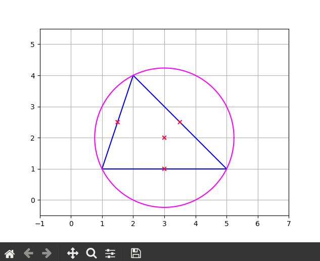

_Author: Stanislav Král A20N0091P_
# SU task 2
## Description of the solution
- `circumscribed_circle.py` 
    - contains cirumscribed circle computation as well as drawing logic
- `main.py` 
    - sets up the `matplotlib` window and loads 3 points of the triangle from stdin
## Example
```
$ python3 main.py
Specify three points, each separated on a new line (format of a point "1.25,1")
Specify a point:
1.0,1.0
Specify a point:
5,1
Specify a point:
2,4
```

Using pipes for a quicker setup:

```
$ echo -e "1.0,1.0\n5.0,1.0\n2.0,4.0" | python3 main.py
```

**output:**



