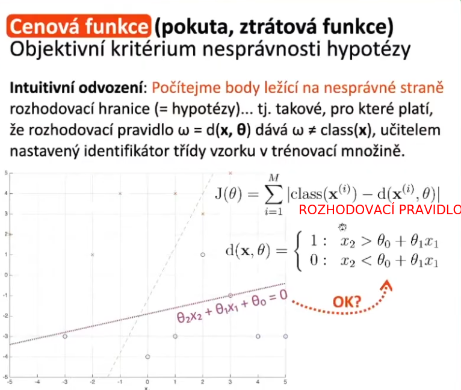

#  **2. Obecná klasifikačnı́ úloha a obecný učı́cı́ se systém** — popis účelu a činnosti jednotlivých částı́ učı́cı́ho se systému; rozhodovacı́ pravidlo, rozhodovacı́ hranice; operátory strojového učenı́; úloha strojového učenı́ (jejı́ podmı́nky a cı́le); učenı́ s učitelem a bez učitele, regrese a klasifikace (aplikace); primitivnı́ lineárnı́ klasifikátor.

- na vstupu máme obecně k dimenzionální vektor (např. obrázek)
- nejdřív je třeba provést extrakci příznaků
    - může být sofistikovaná (hledání hran konvulačním operátorem, na zvuku výpočet spektrální charakteristiky)
    - předzpracujeme si vstupní data
    - klasifikátor totiž často nepracuje s digitalizovanou podobou objektu, ale s jeho projekcí (**obrazem**)
- obraz (projekce objektu) vstupuje do klasifikátoru
- úkolem klasifikátoru je podle nějakého rozhodovacího pravidla je určit do jaké třídy posuzovaná fyzikální entita patří 
    - výstupem je `omega` (číslo) - tj. indikátor třídy (0, 1, 2,...)
    - `omega = d(x, theta)`
        - `d` - **rozhodovací pravidlo**
        - `omega` - nastavení klasifikátoru
            - **získáme učením**

## Popis účelu a činností jednotlivých částí učícího se systému

- **vstup**
    - data, signály
        - nějaká část dat může být použita pro trénování
- **model**
    - obsahuje naší hypotézu
    - řídí chování celého systému
    - musí být zpětnovazebně ovládaný
    - měl by být schopný se doučovat během své činnosti
    
- do všech modulů vstupuje učení
- **model učení**
    - musí zpracovat zpracovat informace ze zpětné vazby zpracovat, a na základě toho upravit koeficienty hypotézy
- **plánování a uvažování**
    - cíle (dlouhodobá strategie)
        - elektrárna
            - spotřebovat co nejméně paliva a vyrobit optimální množství energie
- **výstup**
    - na výstupu je nějaká akce
        - rozhodnutí, do jaké třídy vstup patří
        - skutečná akce, řízení elektrárny (víc topit, méně topit)
- **percepce a transformace**
    - transformace vstupu, extrakce příznaků
- **výpočet činnosti** 
    - optimalizace, akce
- **plánování a uvažování**
    - strategické plánování
## Rozhodovací pravidlo

- funkce projekce reálného objektu a vektoru parametrů hypotézy theta (nastavení klasifikátoru)

## Rozhodovací hranice
- taková hranice, která rozdělí stavový prostor na 2 poloprostory, každý pro jednu třídu

## Operátory strojového učení
- operátory slouží k omezení velikosti prohledávaného stavového prostoru

### Generalizace
- vypustím nepodstatné detaily a soustředil se pouze na podstatný hlavní rysy
- základní a nejdůležitější princip strojového učení
- schopnost natrénovaného algoritmu zpracovat nové, dosud nezpracovaná data
- společné vlastnosti konkrétních instantcí zobecněny jako obecně platné koncepty

### Specializace
- opak generalizace
- konstrukce deklarativních znalostí (výrokové, deskriptivní)
- aplikace obecných znalostí na konkrétní instance
- konkrétní vlastnosti abychom učinili závěr
- sledujeme shodu speciálních znalostí, a tak dojdeme k závěru, že se např. jedná o zvíře (pozorování objektů)
    - `má hlavu & (má srst or kůže or šupiny, ...)`

### Abstrakce
- konceptuální proces, při nemž jsou obecná pravidla a koncepty vyvozovány z použití a klasifikace konkrétních příkladů
- `Franta má 3.7 promile alkoholu v krvi (obstrakce =>) (<= konkretizace) Franta je opilý`
- technické řešení abstrakce je vypouštění informace

### Konkretizace
- opak abstrakce
- přidávat informaci, pokud ji máme k dispozici

### Inference
- jeden určitý krok v uvažování

#### Dedukce
- deduktivní inference
- *top down logika*
- začneme s jednou nebo více premisami, musí být pravdivé, zkoumají fakta, jejich pravdivo, a docházíme k závěru, který je jistý
- aplikace identit
- transformujeme původní výroky (premisy) na závěr
- začínáme teorií, vytváříme hypotézu a potvrzujeme pozorováním
- **nepoužitelné v ML**
    - nemáme k dispozici hypotézu, kterou bychom ověřovali pozorováním

#### Indukce
- *bottom up logika*
- premisy ve formě ověřitelných konkrétních pozorování => slouží jako důkaz obecného závěru
- **závěr, který je pravděpodobný**
- zachovává nepravdivost
- `if každá pozorovaná labuť je bílá then labutě jsou bílé`

#### Abdukce
- také *bottom up logika*
- na začátku připustíme, že naše pozorování jsou neuplná
- vytvořím množinu teorií
- poté hledám takovou teorii, která nejlépe vysvětluje pozorování, a tak dojdu k nejvěrohodnějšímu závěru
- použitelné v ML

## Úloha strojového učení (její podmínky a cíle)

## Učení s učitelem a bez učitele
- s učitelem, bez učitele, zpětnovazební, jiné
- **učení**
    - s učitelem (_Supervised_)
        - učitel (expert) určil, do které třídy vzorek patří
    - bez učitele (_Unsupervised_)
        - žádná informace o zařazení vzorku do určité třídy není k dispozici
- **regrese**
    - hledá se **funkce/křivka**, jež prokládá data tak, aby bylo možné určit hodnotu kdekoli
- **klasifikace**
    - zledá se `(n-1)D` (hyper-plocha), která odděluje data v `nD` prostoru

## Regrese a klasifikace (aplikace)

## Primitivní lineární klasifikátor
