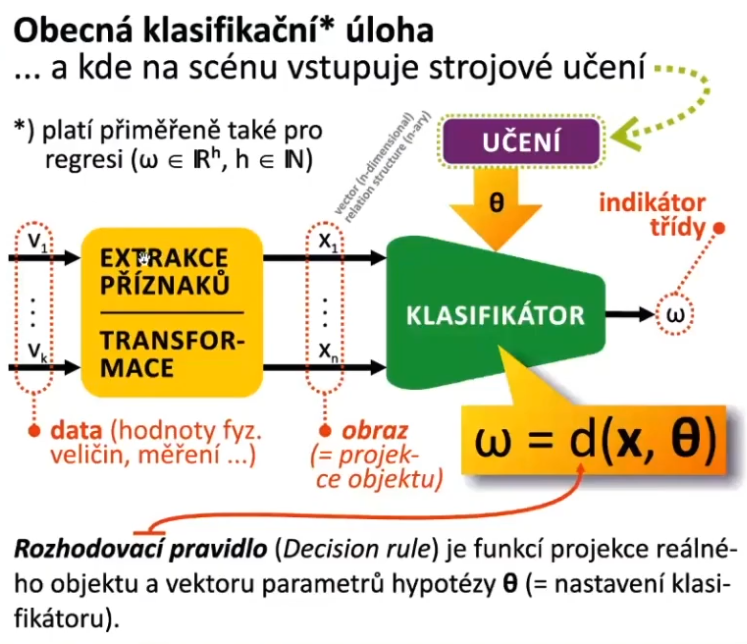
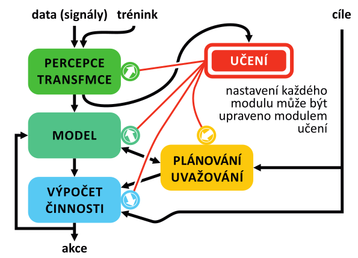

#  **2. Obecná klasifikačnı́ úloha a obecný učı́cı́ se systém** — popis účelu a činnosti jednotlivých částı́ učı́cı́ho se systému; rozhodovacı́ pravidlo, rozhodovacı́ hranice; operátory strojového učenı́; úloha strojového učenı́ (jejı́ podmı́nky a cı́le); učenı́ s učitelem a bez učitele, regrese a klasifikace (aplikace); primitivnı́ lineárnı́ klasifikátor.

- na vstupu máme obecně k dimenzionální vektor (např. obrázek)
- nejdřív je třeba provést extrakci příznaků
    - může být sofistikovaná (hledání hran konvulačním operátorem, na zvuku výpočet spektrální charakteristiky)
    - předzpracujeme si vstupní data
    - klasifikátor totiž často nepracuje s digitalizovanou podobou objektu, ale s jeho projekcí (**obrazem**)
- obraz (projekce objektu) vstupuje do klasifikátoru
- úkolem klasifikátoru je podle nějakého rozhodovacího pravidla je určit do jaké třídy posuzovaná fyzikální entita patří 
    - výstupem je `omega` (číslo) - tj. indikátor třídy (0, 1, 2,...)
    - `omega = d(x, theta)`
        - `d` - **rozhodovací pravidlo**
        - `omega` - nastavení klasifikátoru
            - **získáme učením**

## Popis účelu a činností jednotlivých částí učícího se systému

- **vstup**
    - data, signály
        - nějaká část dat může být použita pro trénování
- **model**
    - obsahuje naší hypotézu
    - řídí chování celého systému
    - musí být zpětnovazebně ovládaný
    - měl by být schopný se doučovat během své činnosti
    
- do všech modulů vstupuje učení

- **výstup**
    - na výstupu je nějaká akce
        - rozhodnutí, do jaké třídy vstup patří
        - skutečná akce, řízení elektrárny (víc topit, méně topit)
- **percepce a transformace**
    - 

## Rozhodovací pravidlo

## Rozhodovací hranice

## Operátory strojového učení

## Úloha strojového učení (její podmínky a cíle)

## Učení s učitelem a bez učitele

## Regrese a klasifikace (aplikace)

## Primitivní lineární klasifikátor
