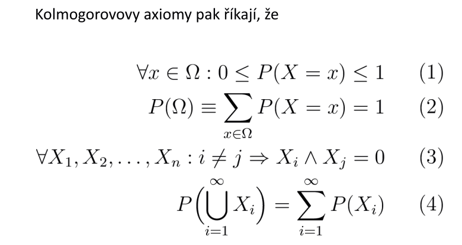
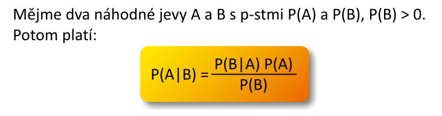
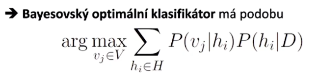
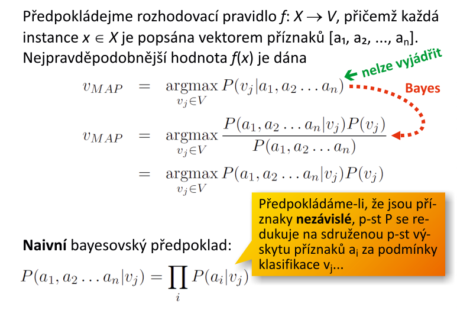
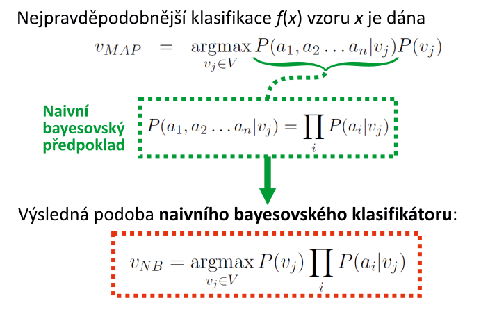
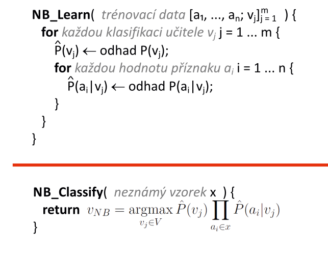

# 3. Bayesovské učenı́ — rámcový popis bayesovských metod, jejich význam a účel, souvislosti; základnı́ pravděpodobnostnı́ aparát, nezávislost jevů; Bayesova věta a jejı́ interpretace; optimálnı́ bayesovský klasifikátor; naivnı́ bayesovský klasifikátor – popis, rozbor činnosti, přı́klady použitı́; strategie výběru hypotézy; učenı́ NBK.

# rámcový popis bayesovských metod
- na bayesovských metodách jsou postaveny dva užitečné a praktické učicí se algoritmy
    - **naivní bayesovský klasifikátor**
    - **bayesovské sítě**
        - odhad parametrů a učení (tj. automatické poznání) závislostní struktury
## jejich význam a účel
- bayesovské metody poskytují poskytují užitečný výchozí **koncepční rámec**
    - poskytují referenční standard (_Gold standard_) k hodnocení výkonu jiných učících se algoritmů - bayesovský optimální klasifikátor
    - jedna z možností implementace Occamovy břitvy
## souvislosti
- poskytuje odlišný náhled na chápání "statistiky" a dat
    - frekvenční vs bayesovská interpretace

# základnı́ pravděpodobnostnı́ aparát
- `Omega` značí **universum** (Sample Space), tj. množinu všech hodnot `x`, jichž může nabývat náhodná proměnná `X`, tj. `X: Omega`

# nezávislost jevů
- jevy A a B jsou **nezávislé** tehdy, je-li `P(A|B) = P(A|!B) = P(A)`
    - tj. `P(A)` je stejná, ať `B` nastane nebo nenastane nebo o `B` vůbec n
ic nevíme
- příklad:
    - mějme dva jevy:
        - A: je středa
        - B: je slunečno
    - zřejmě platí `P(B|A) = P(B)`
        - je nemyslitelné, že by počasí záviselo na dni v týdnu

# Bayesova věta a jejı́ interpretace
- kvantifikuje souvislost podmíněné pravděpodobnosti nějakého jevu s opačnou podmíněnou pravděpodobností

- `P(A|B)` je podmíněná pravděpodobnost jevu `A` za předopokladu, že nastal jev `B`, a naopak `P(B|A)` je podmíněná pravděpodobnost jevu `B` za předpokladu, že nastal jev `A`

# optimálnı́ bayesovský klasifikátor
- v praxi nehledáme nejpravděpodobnější hypotézu (nejpravděpodobnější přiřazení klasifikátorem do dané třídy za podmínky trénovacích dat), ale hledáme nejpravděpodobnější klasifikaci pozorovaného vzorku za podmínky pozorovaných dat 
- např. h-map, je klasifikace vypočítaná z nejpravděpodobnější hypotézy za podmínky pozorovaných dat a apriorních znalostí - **nikoliv nejpravděpodobnější klasifikace**
    - museli bychom provést nekonečně mnoho klasifikaci
- **nezajímá nás nejpravděpodobnější hypotéza, nýbrž nejpravděpodobnější realita**

- `P(hi|D)` - hypotéza na základě pozorovaných dat
    - přenásobíme s `P(vj|hi)`
        - modifikujeme pravdpodobností: *objekt opravdu patří do dané třídy, když klasifikátor říká, že patří do dané třídy*
        - ve zkratce máme čísla, která nám řikají jak pravděpodobné je, že objekt opravdu patří do dané třídy pokud klasifikátor ho zařadil do dané třídy
- **žádný klasifikátor** pracující se stejným prostorem hypotéz `H` a stejnými apriorními znalostmi **nemůže v průměru** `(# -> nekonečno)` **překonat Bayesovský optimální klasifikátor**
    - nelze vyčíslit `P(vj|hi)` - musel bych provést nekonečně mnoho pozorování a znát správně odpovědi učitele

# naivnı́ bayesovský klasifikátor 
## popis
- jeden z nejstarších a současně nejpraktičtějších učících se algoritmů
- velmi jednoduchý pravděpodobnostní klasifikátor založený na **aplikaci Bayesovy věty** a silných (**naivních**) předpokladů o **podmíněné nezávislosti** příznaků klasifikovaných vzorů
- podmínky užití:
    - středně až velmi velká trénovací množina
    - příznaky jsou nezávislé za podmínky dané klasifikace

## rozbor

- **předpokládáme, že příznaky jsou nezávislé**
    - proto je **naivní**

## činnosti
- trénování:
    - spočítám pravděpodonosti odpovědí učitele
    - projedu celou trénovací množinu, počítám pravděpodobnosti pro všechny dílčí jevy
- klasifikace:
    - vemu dílčí pravděpodobnosti které znám z tabulky a násobím je dle vstupního vektoru  
        - vyberu maximum pro kterou třídu je větší hodnota

## přı́klady použitı́
- **klasifikace textu pomocí NBK**
    - zařazení textu do třídy podle tématu (např. na články o politice, počasí, sportu, atd.). NBK patří mezi **nejlepší známé učící se algoritmy** ke klasifikaci textů (**Multinomial Naive Bayes**)
- **filtrování spamu**
    - nejlepší známé užití NBK; klasifikace textu do dvou disjunktních tříd SPAM a HAM, které tvoří úplný sysétm (_tertium non datur_)
- **doporučovací systémy** (_Recommender Systems_)
    - kombinace data miningu a strojového učení ke zpracování dat uživatele (např. zpráv na sociálních sítích) s cílem predikovat, zda takový uživatel má zájem o určitý zdroji (služby, zboží)

# strategie výběru hypotézy
- jelikož nelze vyčíslit jmenovatel bayesovy věty, musíme zvolit strategii výběru hypotézy 
- dokážeme spočítat všechny varianty klasifikace při daném vstupním vektoru - různé hypotézy
    - avšak jmenovatel je ve všech variantách stejný - budeme porovnávat čitatele jednotlivých variant
- strategie:
    - **MAP - Maximum A Posteriory**
        - nejpravděpodobnější hypotéza podmíněná pozorovanými vstupními daty
        - vyberu nějvětší čitatel
        - spočítám pro všechny třídy, vyberu s tou největší relativní ppstí
    - **ML - Maximum Likelihood**
        - nejvěrohodnější hypotéza za předpokladu rovnoměrné disribuce hypotéz, což umožňuje výpočet dále zjednodušit
        - používá se ve chvíli, kdy je distribuce hypotéz rovnoměrná
        - dílčí relativní pravědpodobnosti jevů, který se stejnou ppstí popisuje univerzum
        - nebudeme modulovat pravděpodobností hypotézy, protože jsou rozděleny rovnoměrně
        - hypotézy jsou stejně pravděpodobné    
            - **snažíme se dopočítat pravděpodobnost hypotézy za podmínky dat, ale stačí nám vypočítat pravděpodobnost dat za podmínky hypotézy je největší**
    - **MDL - Minimum Description Length** - Occamova břitva
        - vybereme si tu variantu, která má nejmenší popisnou délku

# učenı́ NBK.
