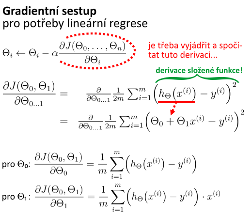
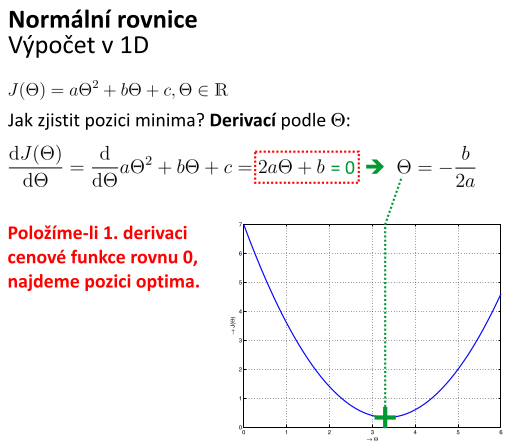
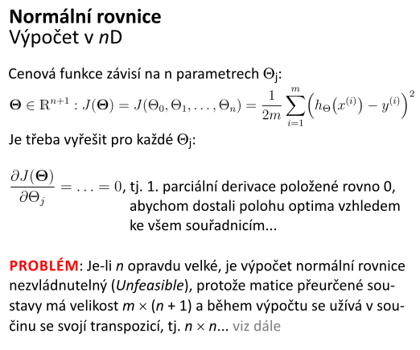
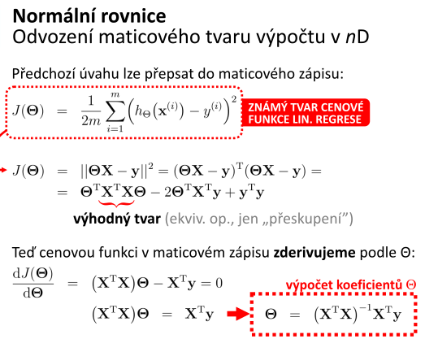

# 4. Lineární regrese - popis techniky; tvar hypotézy; cenová (pokutová) funkce - její tvar a optimalizace; algoritmy učení; gradientní sestup, normální rovnice - popis činností algoritmu, podmínky, problémy; míra učení a její volba

## Popis techniky
- demonstruje fundamentální myšlenky regrese
- poskytuje snadno interpretovatelný popis toho, jak vstupní data ovlivňují data výstupní
- chceme trénovací data proložit lineární funkcí tak, abychom mohli pro libovolnou hodnotu vstupu předpovědět výstupní hodnotu

## Tvar hypotézy

## Cenová (pokutová) funkce - její tvar a optimalizace

## Algoritmy učení

## Gradientní sestup
- normovaná střední kvadratická odchylka počtem bodů
- je dána cenová funkce `J(theta_0, ..., theta_n)`
    - chceme najít hodnoty `theta_i`, pro které **nabývá minima**
- postup:
    - začneme s nějakými hodnotami `theta_i`, např. `0` nebo náhodnými
    - měníme hodnoty `theta_i` tak, aby se snižovala funkční hodnota cenové funkce `J(theta_0, ..., theta_n)`, dokud nenalezneme její minimum (snad)

## Normální rovnice
- u gradientního postupu je pomalá konvergence, je třeba škálovat data, je třeba nastavit míru učení
- analytický postup minimalizace cenové funkce `J(theta)`
    - známe-li její tvar a umíme-li derivovat, pak lze pozici minima zjistit výpočtem

- pro více dimenzí:
    - cenová funkce závisí na `n` parametrech `theta_j`

- **problém**
    - je-li `n` opravdu velké, je výpočet normální rovnice nezvládnutelný (*Unfeasible*)
    - matice přeurčené soustavy má velikost `m * (n + 1)` a během výpočtu se užívá  v součinu se svojí transpozicím tj `n * n`

## Podmínky
- data musí jít modelovat přímkou, jinak nepoužitelné
- pro optimální volbu míry učení je prakticky nezbytné si nechat vykreslit průběh minimalizace cenové funkce
    - podle tvaru křivky volit parametry `alpha`

## Problémy
- při gradientním sestupu:
    - musíme volit míru učení
    - musíme provádět feature scaling
        - jinak zploštění parabolického kýble
    - musí proběhnout mnoho iterací 

## Míra učení a její volba
- označuje se řeckým písmenem `alpha`
- označuje rychlost učení, jak velký krok během jedné iterace učení učiníme
- volba příliš vysokého `alpha` může vést k "přestřelení" a eventuálnímu vyskočení z parabolického kýble
- volba příliš nízkého `alpha` vede k pomalé konvergenci k výsledku
