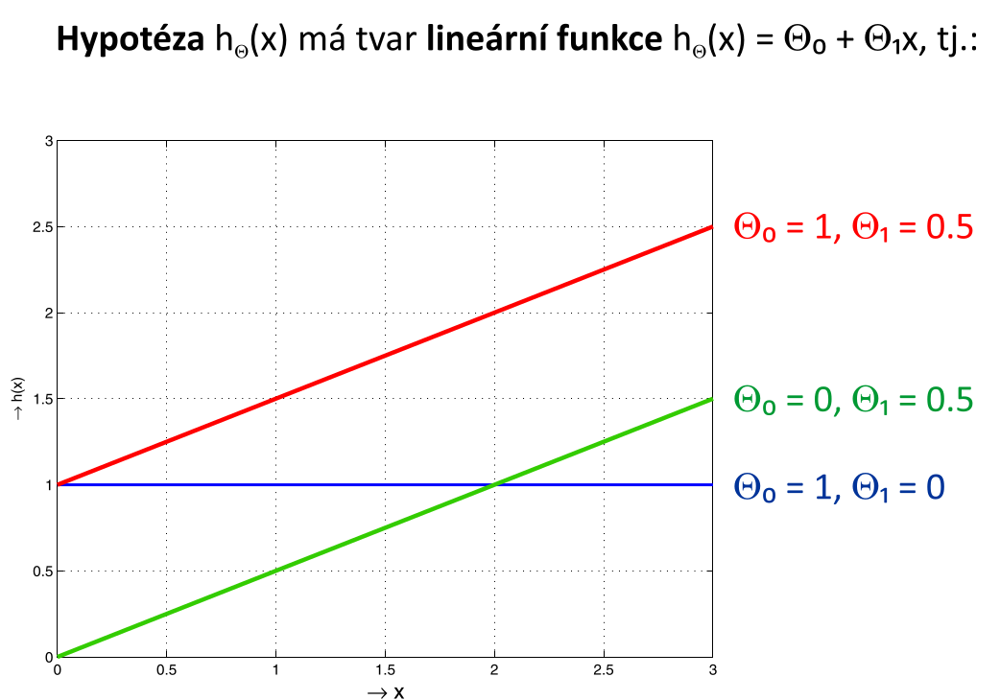
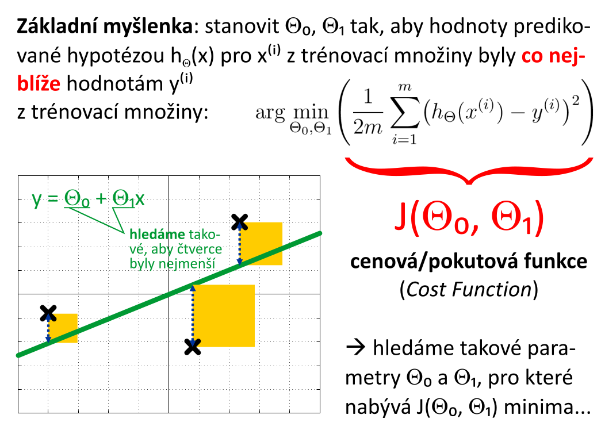

# 4. Lineární regrese - popis techniky; tvar hypotézy; cenová (pokutová) funkce - její tvar a optimalizace; algoritmy učení; gradientní sestup, normální rovnice - popis činností algoritmu, podmínky, problémy; míra učení a její volba

## Popis techniky

## Tvar hypotézy

## Cenová (pokutová) funkce - její tvar a optimalizace

## Algoritmy učení

## Gradientní sestup

## Normální rovnice

## Podmínky

## Problémy

## Míra učení a její volba
- označuje se řeckým písmenem `alpha`
- označuje rychlost učení, jak velký krok během jedné iterace učení učiníme
- volba příliš vysokého `alpha` může vést k "přestřelení" a eventuálnímu vyskočení z parabolického kýble
- volba příliš nízkého `alpha` vede k pomalé konvergenci k výsledku
