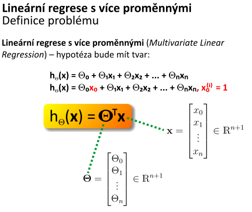
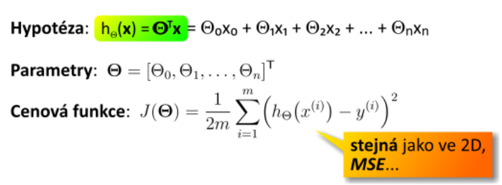
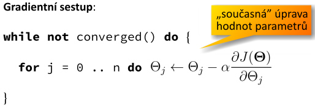
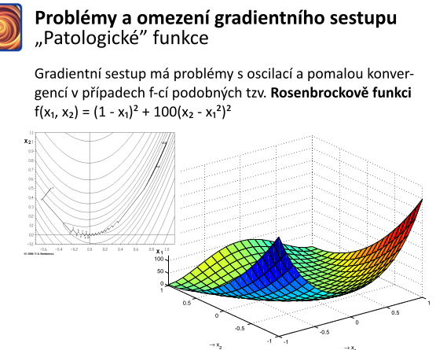
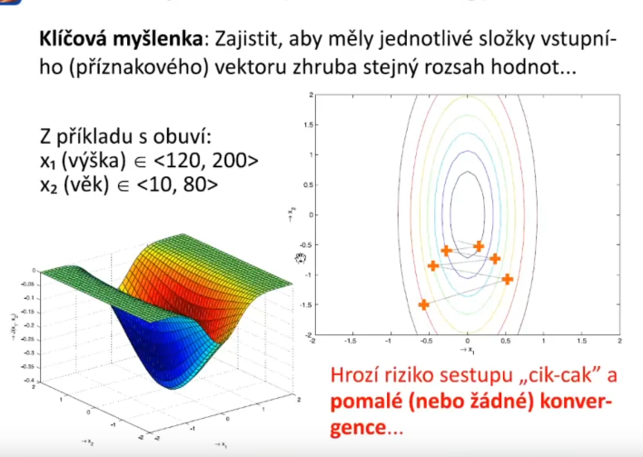
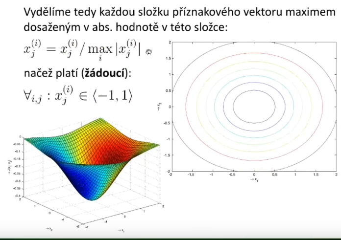
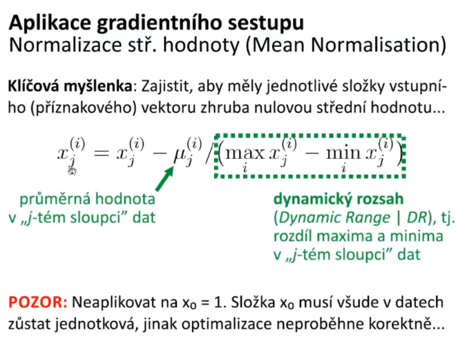

# 5. Vı́cerozměrná lineárnı́ regrese — popis techniky; tvar hypotézy; cenová (pokutová) funkce; gradientnı́ sestup v nD terénu – problémy a omezenı́ (Rosenbrockova funkce); škálovánı́ přı́znaků; mı́ra učenı́

## Popis techniky
- princip stejný jako u jednorozměrné lineární regrese, avšak je třeba upravit hypotézu

## Tvar hypotézy

- aby šlo udělat maticový zápis, tak je třeba přiddat `x0 = 1`

## Cenová funkce

## Gradientní sestup v `nD` terénu

- stejné jako u 1D
    - avšak iteruji přes všechny dimenza (`thety`)
    

### Problémy a omezení (Rosenbrockova funkce)
- není-li funkce derivovatelná, jsou gradientní metody obecně špatně podmíněné (lze řešit např. vyhlazením cenové funkce pomocí aproximace splinem nebo aplikací nějaké negradientní metody)
### Rosenbrockova funkce
- funkce, na které se velmi špatně aplikuje gradientní sestup
- takové fce, kdy mínus gradient nevede optimálně k minimu
- směr gradientu je skoro kolmý na skutečný směr k optimu

- nenastane u lineární regrese

## Škálování příznaků
- pokud mají jednotlivé příznaky různé rozsahy, tak parabolický kýbl může být zploštělý, a tak gradientní sestup trvá velmi dlouho (patologický tvar funkce)
- je třeba zajistit, aby měly jednotlivé složky vstupního vektoru (příznakového) zhruba stejný rozsah hodnot

## Míra učení
- označuje se řeckým písmenem `alpha`
- označuje rychlost učení, jak velký krok během jedné iterace učení učiníme
- volba příliš vysokého `alpha` může vést k "přestřelení" a eventuálnímu vyskočení z parabolického kýble
- volba příliš nízkého `alpha` vede k pomalé konvergenci k výsledku
