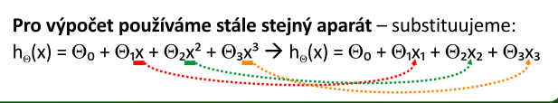
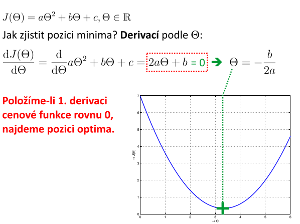

#  6. Polynomiálnı́ regrese — popis techniky; tvar hypotézy; cenová (pokutová) funkce; výběr přı́znaků a volba tvaru hypotézy; normálnı́ rovnice a jejı́ výpočet – možné problémy; kritérium volby mezi NR a GS.
- používá se tehdy, kdy hypotéza nelze modelovat přímkou
- tehdy, kdy není snadné vybrat aproximační křivku

## popis techniky 
- stejné jako u lineární regrese, akorát jako hyptézu nemám přímku, nýbrž nějaký polynom
    - avšak je nutné škálovat rozsahy hodnot

## Tvar hypotézy
- tvar hypotézy si zvolíme tak, aby nám vyhovoval
    - je třeba upravit tvar hypotézy - provést substituci

## cenová (pokutová) funkce; 
- stejné jako u normální regrese - musíme být schopni ji derivovat

## výběr přı́znaků a volba tvaru hypotézy
- např. plocha pozemku ovlivňuje cenu pozemku víc než délka a šířka
- tvar hypotézy - je třeba provést substituci, aby odpovídalu tvaru lineární regrese

## normálnı́ rovnice a jejı́ výpočet – možné problémy
- položíme-li 1. derivaci cenové funkce rovnu 0, najdeme pozici optima

- je li `n` (dimenze) opravdu velké, je výpočet normální rovnice nezvládnutelný
    - matice přeurčené soustavy má velikost `m * (n + 1)` a během výpočtu se užívá součinu se svojí transpozicí, tj. `n * n`

- inverzní matice k `X'T X` nemusí existovat
    - v matlabu pseudoinverzní, aproximovaná `pinv`

## kritérium volby mezi NR a GS.
- máme-li `m` vzorků v trénovací množině, každý o `n` složkách, tak:
    - **gradientní sestup**
        - je potřeba zvolit míru učení - `alpha`
        - musí proběhnout mnoho iterací
        - funguje dobře i tehdy, je-li `n` **velmi velké** 
    - **normální rovnice**
        - není potřeba volit míru učení
        - neiteruje se
        - je třeba násobi a invertovat velké matice `(O(n^3))`
        - velmi pomalý postup, je-li `n` **velmi velké**

