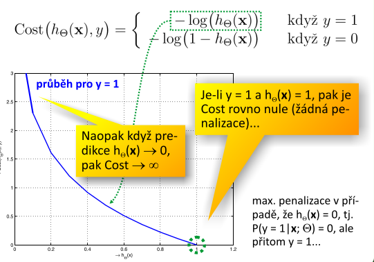

# 7. Logistická regrese — popis techniky; tvar hypotézy a interpretace poskytovaných výsledků; cenová (pokutová) funkce logistické regrese; rozdı́l oproti ostatnı́m regresı́m, smysl a účel použitı́; rozhodovacı́ hranice; optimalizačnı́ techniky; technika One-vs-All.

## popis techniky
- snažíme se odhadnout pravděpodobnost, že modelová veličina nabude hodnoty `1` (tj. např. jev nastane), je-li vstupem vektor příznaků `x`

## tvar hypotézy a interpretace poskytovaných výsledků

## cenová (pokutová) funkce logistické regrese

## rozdı́l oproti ostatnı́m regresı́m, smysl a účel použitı́
- u lineární regrese modelujeme celý prostor reaálných čísel, omezení hypotézy pouze na interval `<0; 1>` je problematické
    - není jednoznačné
    - nelze algoritmem LR dobře určit/natrénovat
    - je velmi citlivé na extrémní marginální hodnoty v trénovací množině
- jedná se o jeden z nejpopulárnějších a nejrozšířenejěších učících se algoritmů
- použití:
    - **email**: spam/ne-spam
    - **lékařská diagnostika nádorů**: zhoubný/nezhoubný
    - **bezpečnost** - autentizovaný/neautentizovaný přístup
    - **lékařská diagnostika**: angina / chřipka / rýmička / kašel

## rozhodovacı́ hranice

## optimalizačnı́ techniky

## technika One-vs-All.
- musíme natrénovat `i` klasifikátoru, kde `i` je počet tříd do kterých můžeme vstupní vzorek klasifikovat
- při klasifikaci neznámého vzorku vybíráme cílovou třídu `i` dle pravděpodobností klasifikace klasifikátory
    - vybíráme tu s maximální pravděpodobností

