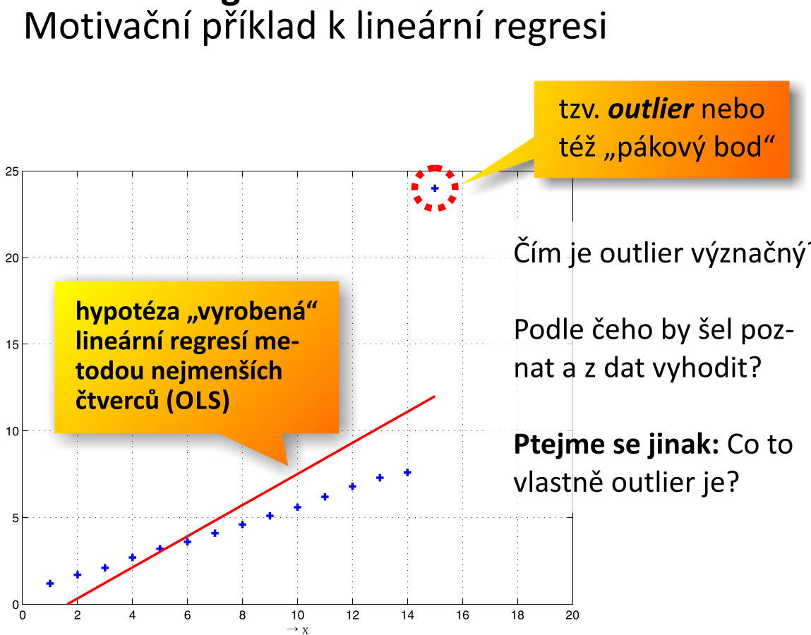
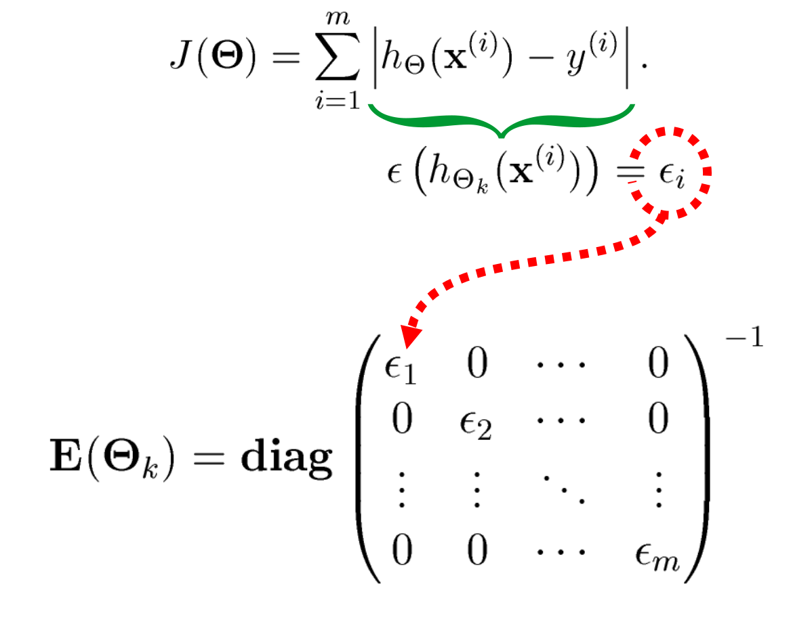
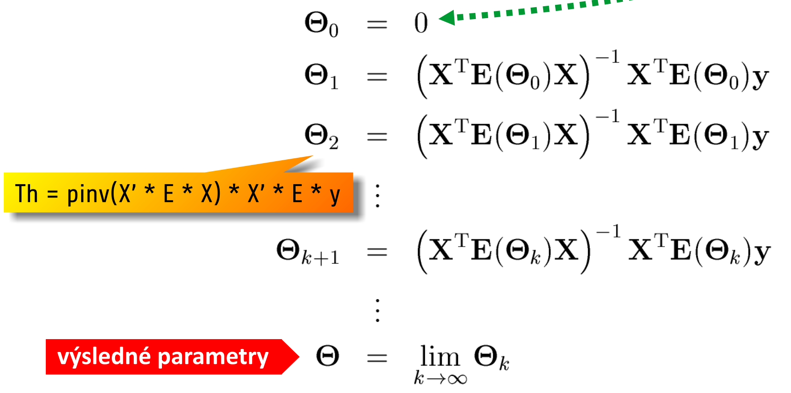
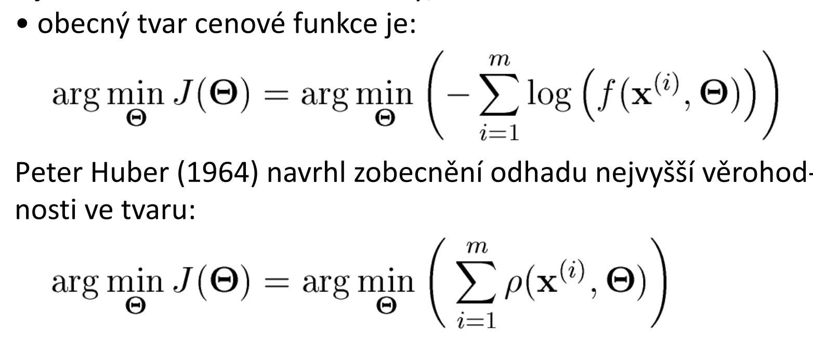
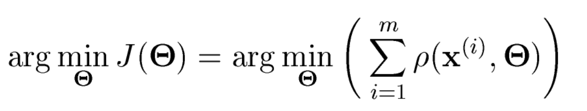
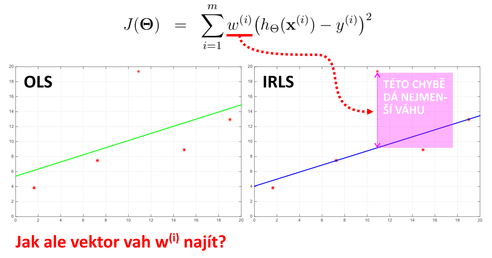
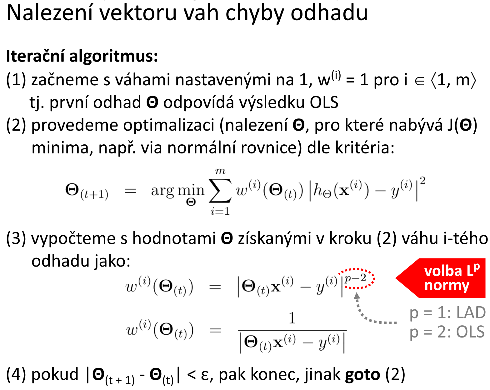
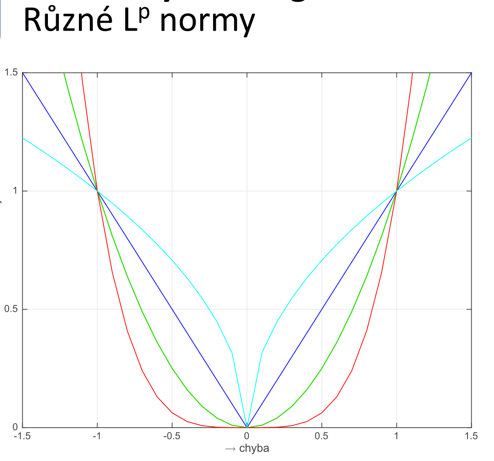

# 8. Robustnı́ regresnı́ metody — posouzenı́ robustnosti regresnı́ch metod, motivace k hledánı́ robustnı́ch metod; definice outlieru, detekce v datech; alternativy metody nejmenšı́ch čtverců: Least Trimmed Squares, Least Absolute Deviations, Mestimation, Iteratively Reweighted Least Squares; RANSAC; Theil-Sen.
- je-li metoda strojového učení označována jako robustní, myslí se tím odolnost vůči nekvalitním, neúplným, zašuměným, nevhodně distribuovaným nebo vzájemně se vylučujícím vstupním datům

## posouzenı́ robustnosti regresnı́ch metod a motivace k hledánı́ robustnı́ch metod
- klasická lineární regrese není považována za robustní
    - stačí jeden outlier a celá hypotéza je značně ovlivněna
- u obyč. metody nejmenších čtverců (**OLS** = Ordinary Least Squares) je hypotéza vychýlena směrem k outlieru tím více, čím "dále od zdravých" dat se nachází
- **metoda nejmenších čtverců není robustní**

## definice outlieru, detekce v datech
- jedná se o bod v datech, který vznikl jiným procesem (např. fyzikálním) než ostatní data
- bod, který se mezi data dostal v důsledku chyby (měření, zpracování dat, apod.)
- bod, který vznikl shodným procesem jako ostatní data, ale je zatížen nesystematickou fluktací šumu

## alternativy metody nejmenšı́ch čtverců:

### Least Trimmed Squares
- stejně jako klasická metoda nejmenších čtverců, ale sumuje se **jen přes** `k < m` **bodů trénovací množiny**
- snažíme se vybrat `k < m` bodů z trénovací množiny takových, že suma čtverců rozdílů bude nejmenší
- jedná se o **kombinatorický problém**
- nedosáhneme optimálního řešení, ale dosáhneme lepšího řešení než klasická metoda nejmenších čtverců

### Least Absolute Deviations
- místo kvadrátu rozdílu odpovědi predikované hypotézou a odpovědi učitele se používá **absolutní hodnota**
- důsledky:
    - neexistuje analytická metoda řešení
    - může existovat více řešení
    - řešení není stabilní
- lze řešit částečně
    - v každém kroku iteračního postupu vypočteme matici chyby predikce, takto:

- parametry hypotézy se na začátku iterace nastaví na `0` a pak se rekurentně upravují až do splnění kritéria konvergence

### M-estimation
- jedná se o zcela obecný přístup k řešení problému
- nejmenší čtverce jsou spec. případem M-estimátoru

- při splnění určitých požadavků na tvar funkce `ro` je taková minimalizace vždy proveditelná, ať iteračně nebo nalezením kořene derivace položené rovno 0 (může být matematicky komplikované)
- existuje několik typů M-estimátorů, také tvarů funkce `ro` může existovat mnoho
- výpočetní postup dovolující minimalizaci cenové funkce v tomto obecném tvaru se nazývá **Iteratively Re-Weighted Least Squares (IRLS)**

### Iteratively Reweighted Least Squares
- **základní myšlenka**: každý sčítanec celkové chyby hypotézy může mít nějakou váhu, tzn. optimalizační proces si může některých chyb "všímat" více a některých méně, tedy:

- různé `L^P` normy mají různou rychlost jak penalizují outliery

## RANSAC

- **RANdom Sample And Consensus)** - zvládá bod zhroucení až 50%
- iterativně se opakují 2 kroky:
    1. **Tvorba hypotézy** - z trénovací množiny se náhodně vybere minimální množina vzorků (tzn. jen tolik vzorků z trénovací mn., kolik je třeba pro lineární regresi - 2), vypočte se optimální `h (x)` (např. LinR).
    2. **Test** - testuje se, kolik vzorků z trénovací množiny neobsažených v náhodném výběru vyhovuje vytvořené hypotéze. Množina takových vzorků se nazývá _Consensus Set (CS)_
- konec iterace: Nelze-li najít lepší (větší) CS
- to zdali vzorek vyhovuje hypotéze se určuje dle _Noise scale_ (modelujeme šum) - řekneme jakou chybu už označujeme za kritickou - vzorek nevyhovuje

## Theil-Sen.
- geometrická metoda robustní lineární regrese
- efektní a snadno naprogramovatelný výpočet `O(n^2)`
- málo citlivý na šum v datech, **breakdown point zhruba 29.3%**
- použití v astronomii, biofyzice, DPZ
- algoritmus:
    1. vytvoříme `m * (m - 1)` hypotéz (přímek), ve tvaru `y = kx + q` (směrnicový tvar) tak, že vezmeme každý bod z trénovací množiny a proložíme jím přímky procházejíci všemi ostatními body
    2. z takto vytvořených hypotéz pak vypočteme průměrnou hypotézu jako medián - výpočtu mediánu se ale smí zúčastnit použe ty hypotézy, které mají koeficient `k` (tedy sklon přímky) nenulový, tj. nejsou konstantami (*konstanty jsou vyloučeny proto, že jejich příspěvek k průměru je nulový, ale zvýšily by počet průměrovaných položek, takže b výsledná prměrná hodnota "sklonu" hypotézy byl menší, než by měla být* 
- úpravy:
    - **Siegel (182)** - vypočítá se medián všech hypotéz procházejících jedním bodem, celková výsledná hypotéza se počítá jako medián z těchto mediánů
    - **párování hypotéz** - hypotézy se párují podle řádu x-ové souřadnice (hypotéze s nejnižší hodnotou x je v páru s první hypotézou nad mediáném), celková výsledná hypotéza se počítá jako medián z těchto párů
    - **vážené mediány** - větší váhu dostávají páry vzorků, jejichž x-ové souřadnice se od sebe více liší
    

