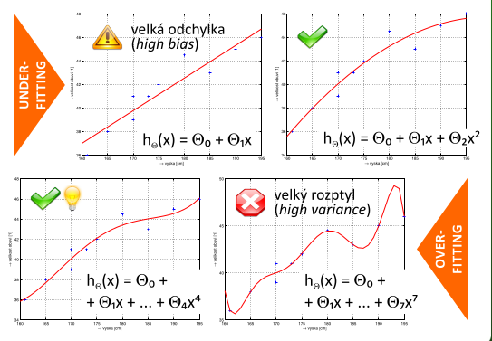
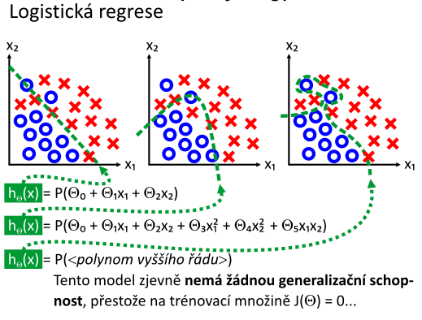
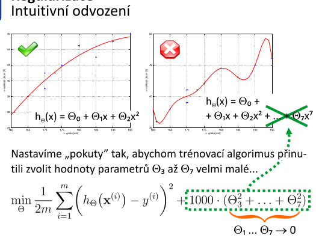
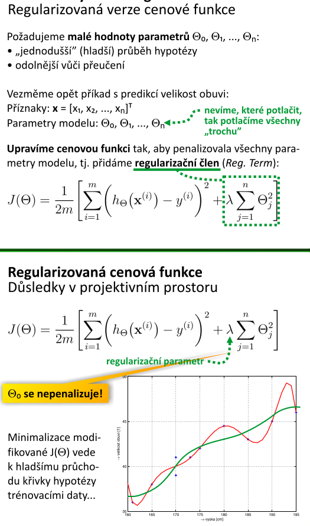
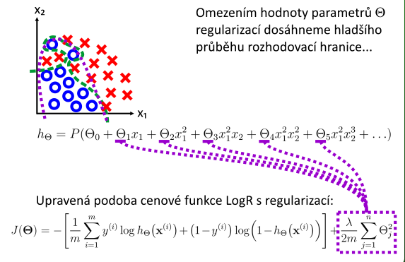
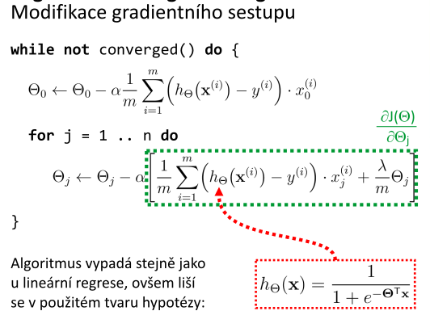

# 9. Regularizace — popis techniky, jejı́ význam a účel; underfitting/overfitting; bias a rozptyl – význam veličin a jejich vyváženı́; potlačenı́ přeučenı́ – postupy; matematicko-logické pozadı́ regularizace; regularizovaná cenová (pokutová) funkce a regularizované verze lineárnı́ a logistické regrese; pokročilá optimalizace regularizovaných cenových funkcı́ pomocı́ výpočetnı́ho software.

## popis techniky
- do výpočtu zavedeme další informaci, aby bylo možné řešit špatně podmíněnou nebo přeurčenou úlohu
- zavedená informace:
    - penalizace složitosti (např. omezením hladkosti nebo normy vektorového prostoru)
    - výběr parametrů modelu z nějaké distribuce, tj. jejich apriorní odhad
- **regularizace se využívá při výběru modelu**
    - provádí se implicitní nebo explicitní penalizace modelu podle počtu jeho parametrů

## jejı́ význam a účel
- používá se, aby nedocházelo k přeučení a zlepšila se generalizace
- chceme řešit i špatně podmíněné nebo přeurčené úlohy

## underfitting/overfitting

- **overfitting** - přeučení
    - máme-li příliš složitý model, natrénovaná hypotéza dokonale prochází body z trénovací množiny, ale neposkytuje dobrou aproximaci modelované úlohy: selhává při **generalizaci**, tj. predikci modelované veličiny v zadaném bodě

## bias a rozptyl – význam veličin a jejich vyváženı́
- bias - odchylka
    - např. modelujeme lineární funkcí, i když realita definovaná trénovacími daty má jiný tvar
- velký rozptyl - velké koeficienty theta (váhových parametrů)

## potlačenı́ přeučenı́ – postupy
- křížová validace (_Cross validation_)
    - vezmu část trénovacích dat, natrénuji model, a následně ověřím úspěšnost oproti zbytku trénovacích dat
- včasné zastavení (_Early stopping_)
- prořezávání (_Prunning_)
- apriorní modelování distribuce parametrů
- porovnání modelů na ověřovací množině
- **regularizace**
- **snížení počtu příznaků**
## matematicko-logické pozadı́ regularizace
- **Occamova břitva** - _Máme li stejně dobré konkurenční hypotézy, vyberme tu, která vyžaduje nejméně premis._
    - nejlepší je právě ta nejjednodušší hypotéza, i za cenu např. o trochu horší přesnosti

## regularizovaná cenová (pokutová) funkce a regularizované verze lineárnı́ a logistické regrese
### lineární regrese

### logistická regrese

## pokročilá optimalizace regularizovaných cenových funkcı́ pomocı́ výpočetnı́ho software.
- využití algoritmů pokročilé optimalizace dostupné v knihovnách MATLAB/Octave
- stačí naprogramovat regularizovanou cenovou funkci a tu pomocí těchto algoritmů minumalizujeme
- např. `fminunc` z MATLABu/Octave

