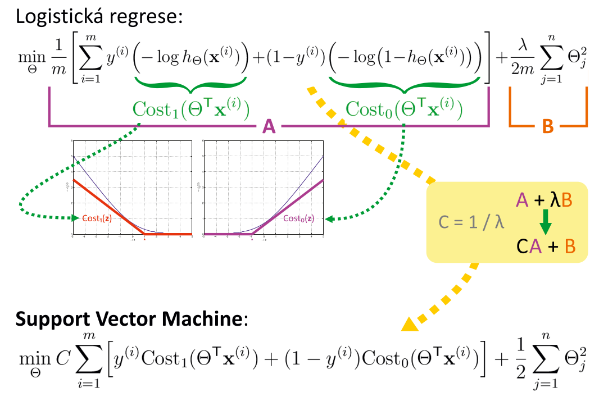
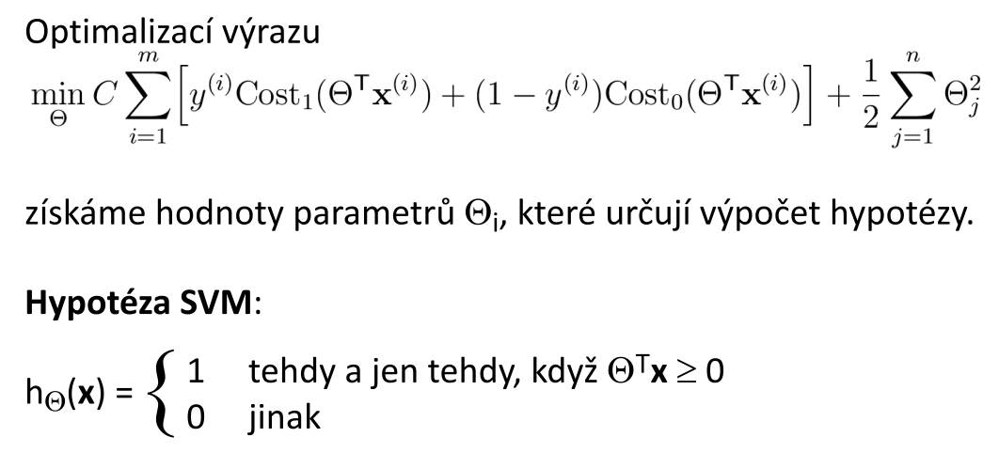
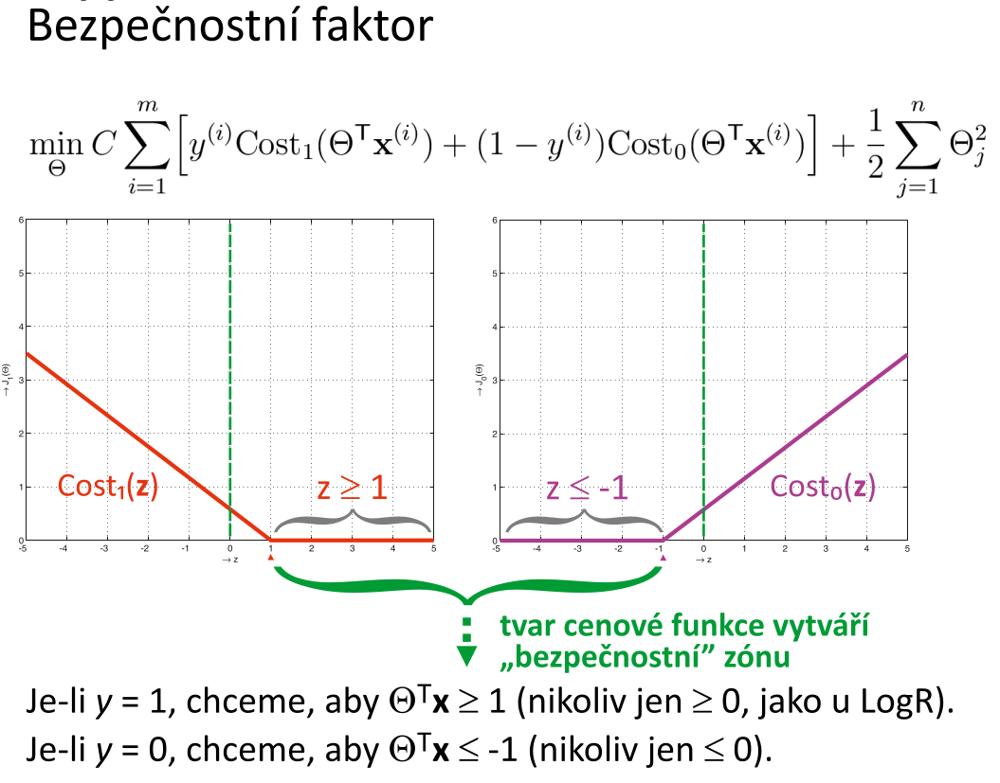
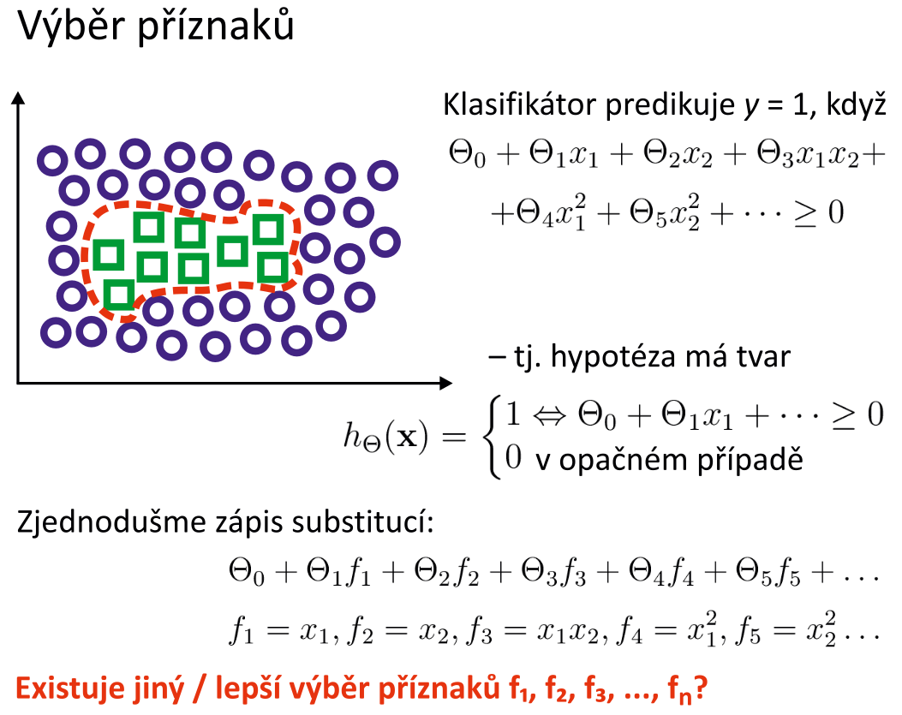
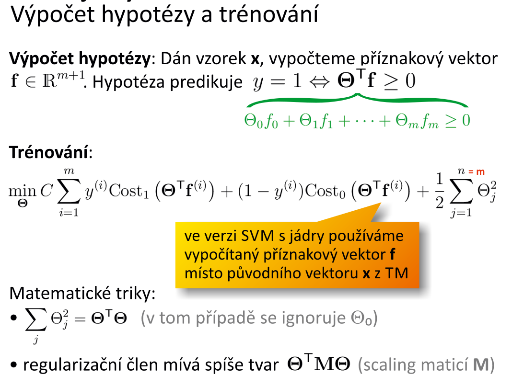

# 10. Support Vector Machines — popis techniky; matematický model; tvar hypotézy a rozhodovacı́ hranice – odvozenı́ tvaru a mechanismus umı́stěnı́; nelineárnı́ rozhodovacı́ hranice, jádra, jejich podoby; úprava hypotézy ve verzi s jádry, výběr landmarků; trénovánı́, vyváženı́ biasu a rozptylu; nasazenı́ SVM, podmı́nky, výhody/nevýhody.

## popis techniky
- metoda strojového učení, která v klasifiékační úlože slouží k nalezení **optimální rozdělující nadroviny** oddělující trénovací data v prostoru příznaků
- **optimální nadrovina**
    - body projekce trénovacích dat leží na jejíchz opačných stranách, tj. v poloprostorech, které tato nadrovina odděluje, a minimum vzdáleností bodů od této nadroviny je co největší (tj, po obou stranách této nadroviny je co nejšírší pás bez bodů)
- k popisu takové nadroviny stačí pouze nejbližší body, kterých je obvykle málo - tzv. **podpůrné vektory** (_Support Vectors_)
- je to binární klasifikační technika, rozdělující nadrovina je v prostoru příznaků lineární funkcí 

## matematický model

- **body, které jsou hodně blízko rozhodovací hranice jsou penalizovány**

## tvar hypotézy a rozhodovacı́ hranice – odvozenı́ tvaru a mechanismus umı́stěnı́

- na rozdíl od logistické regrese **hypotéza používaná SVM nevyjadřuje pravděpodobnost**, ale přímo příslušnost klasifikovaného  vzorku k třídě 1 nebo 0

## nelineárnı́ rozhodovacı́ hranice, jádra, jejich podoby

## úprava hypotézy ve verzi s jádry

## výběr landmarků

## trénovánı́ 

## vyváženı́ biasu a rozptylu

## nasazenı́ SVM

## podmı́nky

## výhody/nevýhody.

