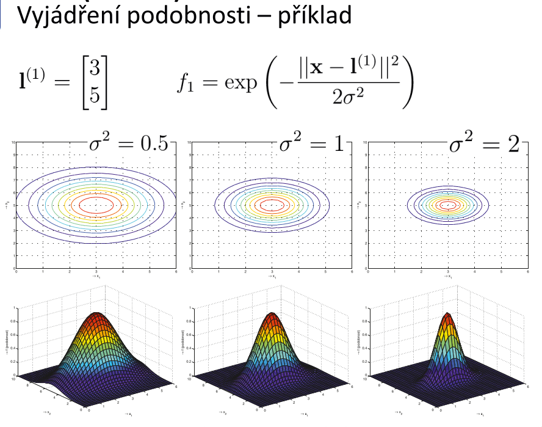

# 10. Support Vector Machines — popis techniky; matematický model; tvar hypotézy a rozhodovacı́ hranice – odvozenı́ tvaru a mechanismus umı́stěnı́; nelineárnı́ rozhodovacı́ hranice, jádra, jejich podoby; úprava hypotézy ve verzi s jádry, výběr landmarků; trénovánı́, vyváženı́ biasu a rozptylu; nasazenı́ SVM, podmı́nky, výhody/nevýhody.

## popis techniky
- metoda strojového učení, která v klasifiékační úlože slouží k nalezení **optimální rozdělující nadroviny** oddělující trénovací data v prostoru příznaků
- **optimální nadrovina**
    - body projekce trénovacích dat leží na jejichž opačných stranách, tj. v poloprostorech, které tato nadrovina odděluje, a minimum vzdáleností bodů od této nadroviny je co největší (tj, po obou stranách této nadroviny je co nejšírší pás bez bodů)
- k popisu takové nadroviny stačí pouze nejbližší body, kterých je obvykle málo - tzv. **podpůrné vektory** (_Support Vectors_)
- je to binární klasifikační technika, rozdělující nadrovina je v prostoru příznaků lineární funkcí 

- chceme, aby rozhodovací hranice byla "co nejdál" od jednotlivých bodů klasifikovaných tříd

## matematický model

- **body, které jsou hodně blízko rozhodovací hranice jsou penalizovány**

## tvar hypotézy a rozhodovacı́ hranice – odvozenı́ tvaru a mechanismus umı́stěnı́

- na rozdíl od logistické regrese **hypotéza používaná SVM nevyjadřuje pravděpodobnost**, ale přímo příslušnost klasifikovaného  vzorku k třídě 1 nebo 0

## nelineárnı́ rozhodovacı́ hranice, jádra, jejich podoby

## úprava hypotézy ve verzi s jádry

- `f` je podobnostní funkce

## výběr landmarků
- landmarky slouží pro definici nelineární rozhodovací hranice
- příznaky vzorku `x` vypočteme jako jako funkci vzdálenosti k bodům

## trénovánı́ 
- landmarky jedné třídy dávají kladný příspěvěk
    - landmarky z druhé třídy přispívají negativně

## vyváženı́ biasu a rozptylu

## nasazenı́ SVM
- nasazení SVM je vhodné pokud v trénovací množině není příliš položek
- SVM není na implementaci jednoduché, je lepší použít knihovnu
    - při použití knihovny je většinou potřeba zadat následující parametry:
        - hodnotu regularizačního parametru [C]
        - jaký kernel se užije pro výpočet "podobnosti" vzorku s landmarky
            - v závislosti na volbě kernelu je pak nutno ještě specifikovat parametry příslušného kernelu (pokud nějaké má)

## podmı́nky
- ideálně mít malý počet příznaků, jinak nízkodimenziální úlohu můžeme převést na mnohadimenziální
- je nutné, aby podobnostní funkce vyhovovala tzv. **Merceově větě**, tzn. musí se jednat o symetrickou pozitivně-definitní funkci - tato podmínka musí být splněna zejména proto, aby pokročilé optimalizační algoritmy fungovaly správně a konvergovaly
    - funkce musí nějakým způsobem počítat vzdálenost bodu od landmarku
- pokud máme velký počet příznaků, lepší použít neuronku

## výhody/nevýhody.
- rychlejší než neuronky
    - rychleji se naučí
- v některých případech dokáže popsat složitější rozhodovací hranici než neuronky
- nevhodné, pokud máme v trénovacích datech mnoho trénovacích vzorků 

