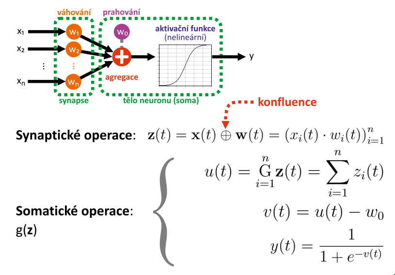

# 11. Neuronové sı́tě — definice, popis paradigmatu, vlastnosti, oblasti a způsob použitı́; biologický neuron, jeho matematický model, McCulloch- Pittsův neuron, RBF neuron; aktivačnı́ funkce; vrstevnaté sı́tě, MLP; cenová funkce a jejı́ optimalizace; trénovánı́, backpropagation, klasifikace neuronovou sı́tı́.

## definice
- matematický simulační model informačního procesoru inspirovaný biologickými neuronovými sítěmi, zejména lidskou nervovou soustavou a mozkem
- neuronová síť se skládá z množiny **umělých neuronů**, které mohou být uspořádány do **vrstev** a navzájem propojeny **synapsemi**, jejichž významnost určují **synaptické váhy**
- neuronová síť je adaptivní systém, který mění svojí strukturu během fáze učení
    - modeluje komplexní relace mezi vstupy a výstupy, popř. hledá ve vstupních datech vzory

- **synaptické operace** - na vstupu synapsí 
    - **konfluence** - zobecněný pojem, kdy můžeme použít jiný způsob výpočtu, než násobení (než  `váha * vstup`)
- **somatické operace** 
    - provádím sečtení vstupů
        - nemusí to být nutně sečtení, ve vzorečku obecný operátor G, lze místo něj použít jiný operátor (např RBF vs LBF)
    - poté odečtu práh (nepovinné, můžu již dělat v konfluenci)
    - poté spočtu aktivaci pomocí aktivační funkce

## popis paradigmatu
- předobrazem matematického modelu je biologický neuron
- pokud neuronové síti předhodíme dostatečné množství dat, nalezne v nich souvislosti, vzory, a naučí se jak klasifikovat neoznačená data
- předpokladem je velmi velká trénovací množina
    - v několika řádech větší, než např. u logistické regrese či SVM
- "realizované pomocí velkého počtu lineárních logisticko regresních klasifikátorů binárních" => sjednocením je schopne vymezovat velice komplexní oblasti

## vlastnosti
- dlouhá doba nutná pro trénování
- potřebuje velmi velkou trénovací množinu
- dokáže sestavit velmi komplexní rozhodovací hranici (nelineární)

## oblasti a způsob použitı́
- výzkum oblasti modelování informačních systémů živých organismů
- výzkum procesů učení, testování, adaptace a **generalizace**
- predikce časových řad (ekonomie, ekologie, energetika, doprava, meteorologie, logistika)
- analýza segmentů (EKG, EEG, akustika)
- de-/komprese a kódování signálů (telekomunikace)
- adaptivní řízení technologických celků
- automatické řízení autonomních systémů

## biologický neuron jeho matematický model

## McCulloch - Pittsův neuron

## RBF neuron
- zatímco LBF (_Linear Basis Function_) dělí vstupní prostor lineárně prostřednictvím n-rozměrných nadrovin, tak RBF děli vstupní prostor prostřednictvím hyperkoulí

## aktivačnı́ funkce
- výběr vhodné aktivační funkce závisí na charakteru řešené úlohy
- měla by být nelineární

- do určité doby byla vždy volena sigmoida
- důvod nelinearizace:
    - abychom mohli vytvářet složitější rozhodovací hranice
        - vzdálenost od rozhodovací hranice nějak nelineárně kvantifikovali
    - aby ideálně v blízkosti rozhodovací hranice byla strmá, funkce která ovlivňuje aktivaci neuronu 
        - abychom byli schopni rozhodnout o klasifikaci do dané třídy i v případě kdy se projekce daného bodu pohybuje v blízkosti dané hranice
    - tam kde se nám protínají ty dílčí rozhodovací hranice, tak ta nelineární aktivační funkce nám dává možnost vytvořit "oblý" tvar rozhodovací hranice
- dnes se používá RELu
- musí být spojitá, spojitě diferenciovatelná v celém oboru R
    - kvůli trénování

## vrstevnaté sı́tě (MLP)

- vícevrstvý perceptron
- jednotlivé neurony se kvůli možnosti klasifikovat více tříd, složitější rozhodovací hranice
- tvoří se více vrstev neuronů
- použiji vstupní vrstvu
    - neurony, které jsou postavené "vedle" sebe
    - dají se považovat za virtuální, protože na vstupní vrstvě se nepočítá aktivace neuronu
    - jako aktivace se použivají přímo vstupní data (max. grayscale hodnota pixelu)
- neurony nejsou v rámci jedné vrstvy propojené
- skrytá vrstva
    - aktivace této vrstvy se spočítá jako synaptická a somatická operace
    - vrstvy MLP jsou úplně propojené
    - do každého neuronu skryté vrstvy přichází aktivace z předchozí vrstvy
- výstupní vrstva
    - každý neuron této vrstvy představuje indikátor příslušné třídy
        - čím více je daný neuron aktivován, tak tím více je NS přesvědčena, že daný vzorek patří do dané třídy
    - nelze interpretovat statisticky
    - vybírá se maximální hodnota
- Cybenkův teorem
    - dle Cybenka stačí jedna skrytá vrstva, pokud je tato vrstva dostatečně veliká
    - poté je ta síť schopna aproximovat jakokoliv reálnou funkci 

## cenová funkce a jejı́ optimalizace
- vezmeme cenové funkce každého neuronu (funkce logistické regrese)
    - posčítáme je od k do K (přes celou síť)
- v regularizačním členu přibydou další dvě sumace
    - jdeme přes vrstvy (krom vstupní vrstvy) 
- každý neuron má tolik vah kolik bylo neuronů v předchozí vrstvě 
- spočítám cenovou funkci pro celou neuronovou síť
    - poté ji mohu nějak optimalizovat (glob. minimum => taková kombinace vah, která klasifikuje dle daných trénovacích dat nejlépe)
        - s nejmenší chybou zařazovat podle učitele
- cílem optimalizace je minimalizace cenové funkce
- abychom byly schopni zminimalizovat => musíme umět zderivovat cenovou funkci (ideálně parciálně podle všech vah)
    - gradient bude mít komponent tolik, kolik je vah
- přímý analytický výpočet derivace je problém
    - musíme po částech 

## trénovánı́ 
- začíná se **forward propagation** (dopředné šíření)
    - činnost NS, kdy do ní vstupuje přiznakový vektor, který chceme klasifikovat
    - aktivace vstupní vrstvy, nakopírování vstupních dat
    - aktivují se další vrstvy
- postupně s vypočítají aktivace všech neuronů v celé síti

- pokračuje se zpětným šířením

## backpropagation
- jedná se vlastně o postupný iterační numerický výpočet derivace celkové pokutové funkce celé sítě
- chybu na výstupní vrstvě dokážu snadno vypočítat

- počítám chyby na dalších vrstvách (rozdíl od požadované aktivace neuronu)
    - chyba na předchozí vrstvě vynásobená derivací váhy vstupu
    - počítá se míra růstu chyby (váhy ovlivňují změnu aktivace)
    - derivace aktivační funkce počítaná **numericky** při daném vstupu konkrétního neuronu
    - tento vektor vynásobím vektorem vah
    - potřebuji chybu rozdistribuovat mezi neurony skryté vrstvy přírustkem jakým ony přispěly k chybě na předchozí vrstvy
- chain rule
    - výpočet chyby mi řetězí chyby/aktivace ze všech předchozích vrstev
- chybový vektor pro vstupní vrstvu nemá cenu počítat
- dokážu chybu z výstupní vrstvy rozdistribuovat mezi neurony celé sítě
    - dokážu určit jakým příspěvkem ten daný konkrétní neuron v dané vrstvě přispěl k celkové chybě klasifikace
- potřebuji všechny parciální derivace => komponenty gradientu (směr největšího růstu/poklesu pokutové funkce)
- postup trénování:
    - nastavím si matici koeficientů kterou budu upravovat dané váhy na nulu
    - projedu celou množinu z trén. množiny
    - provedu forwarding propagation
    - na výstupní vrstvě vypočítám chybový vektor 
    - dostanu chybu na lté vrstvě
    - začnu zpětné šíření chyby
        - vypočítám si chybu pro všechny skryté vrstvy
    - pak upravím matici chyb tak, že k ní připočítám hodnotu té parciální derivace
        - jedná se o gradientní sestup
    - poté příslušně upravím váhy synapsí
        - regularizuji, krom první prahů
    - toto je jeden průchod trénovací množinou (iterace == epocha)
    - opakuji tak dlouho dokud mi ta síť neposkytuje uspokojivé výsledky
        - třeba 100 000 epoch
    - jedná se o zamaskovaný gradientní sestup

## klasifikace neuronovou sı́tı́.
- **binární klasifikace**
    - pouze 1 neuron ve výstupní vrstvě
    - aktivace výstupního neuronu indikuje, zda vzorek do dané třídy patří nebo nepatří
    - avšak je třeba stanovit nějaký práh, od kterého budeme považovat, že daná aktivace představuje příšlušnost do dané třídy
    - neuron totiž bude vždy aktivován
    - práh lze stanovit experimenty
- **multi-class klasifikace**
    - na výstupní vrstvě tolik neuronů, kolik klasifikujeme tříd
        - vybíráme neuron s maximální aktivací => do té třídy patří klasifikovaný vzorek
