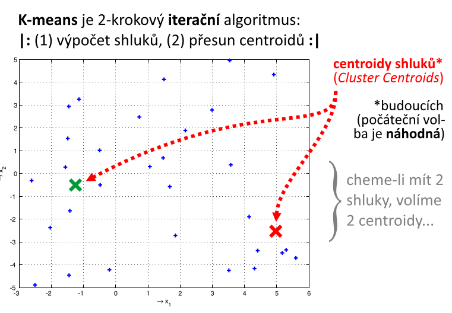
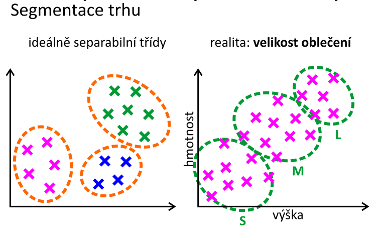
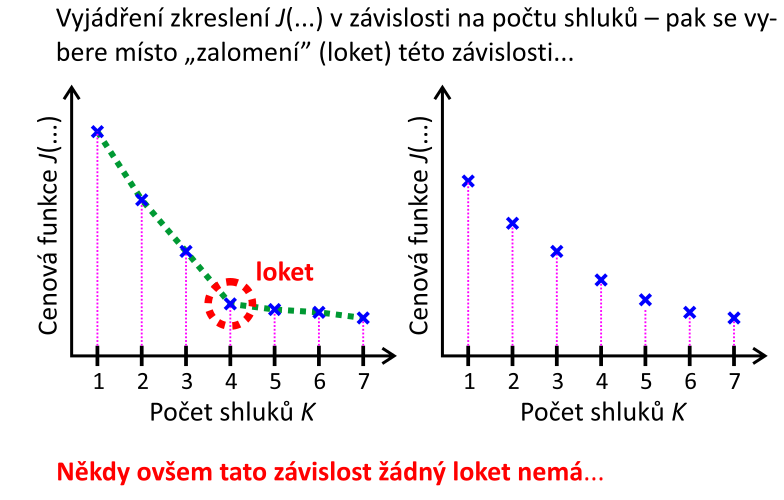
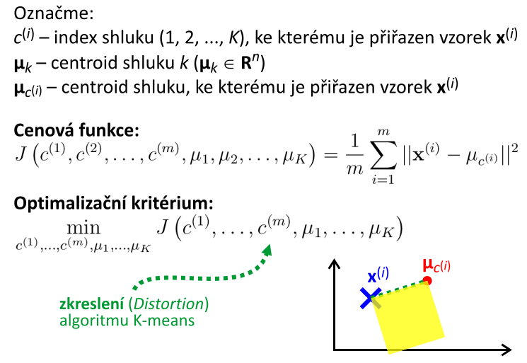

# 12. Clustering (shlukovánı́) — popis techniky, podstata, účel a využitı́; metoda K-means; centroidy, jejich výběr, algoritmus K-means; strategie volby počtu shluků (metoda lokte), cenová funkce, optimalizačnı́ úloha shlukovánı́; trénovánı́.

## popis techniky a podstata
- **úloha učení bez učitele**
- algoritmus se pokouší nalézt v datech nějakou organizaci/strukturu
    - např. **shluky**
- můžeme se podívat, zdali body které představují projekce jednotlivých entit neleží blízko sebe
    - zdali netvoří nějaké útvary/organizaci

### účel a využitı́
- hodí se v situacích, kdy nepotřebujeme znát odpovědi
    - důchodce, nižší/vyšší sociální třída, ...
- analýza a segmentace trhu
    - reklama, marketing
- agregace informací
- analýza sociálních sítí
    - cílená reklama
- organizace výpočetních clusterů/cloudů
- zatížení energetické sítě
- astronomie, genetika

## metoda K-means
- 2-krokový iterační algoritmus
- _K-středních hodnot_
- neustále se opakují dva kroky:
    - výpočet shluků
    - přesun centroidů
- **centroid**
    - bod ve stavovém prostoru představující referenční střed shluku
- algoritmus začíná **náhodnou volbou** centroidů
    - podle toho kolik chceme shluků, tolik volíme centroidů

### centroidy a jejich výběr
- slabé místo algoritmu: **náhodná inicializace K centroidů**
    - špatné umístění centroidů => špatné lokální optimum
- lepší volba:
    - **vyberu náhodně nějaký bod z trénovací množiny a zvolím ho jako centroid**
- provedu algoritmus k-means **i-krát**
    - vyberu si to shlukování, pro které je nejmenší cenová funkce
    - funguje nejlépe pro malý počet shluků
    - to nám negarantuje nalezení glob. optima, nýbrž zvyšuje šanci na jeho nalezení

### algoritmus K-means

- výběr
- projdu celou trénovací množinu
    - pro každý prvek v množině spočtu vzdálenost ke všem centroidům
    - k tomu centroidu, ke kterému je daný prvek blíž, tak k tomu ho přiřadím
    - tak to udělám pro všechny prvky
    - tímto dostanu 2 shluky
    - avšak tuto chvíli umístěné centroidy nejsou v optimální poloze
        - tj. ve střední hodnotě všech obarvených bodů přiřazených k danému centroidu
    - spočtu střední hodnotu napříč všemi body v dané skupině bodů, čímž dostanu novou polohu centroidu
        - tj. **těžiště shluku**
    - provedu znovu přiřazování bodů ke shluků
- konvergenční kritérium:
    -  dokud se mění přiřazení bodů do shluků
- **důsledek nepřesnosti reprezentace realných čísel na počítačích**
    - nějaké body napříč iteracemi přeskakují mezi příslušnosti do tříd
    - popsaný jev, **oscilace algoritmu**

## strategie volby počtu shluků (metoda lokte)
- v praxi se dá často zvolit manuálně podle analýzy dat 
    - dle charakteru úlohy
- optimalizace cenové funkce, během které měním počet shluků

- pokud cenová funkce nemá "loket", blíží se k nule bez jasného skoku, lze říct, že **data netvoří clustery** a rovnoměrně pokrývají stavový prostor
    - musím přejít k manuální volbě
- **downstream purpose** (metoda vyhovění účelu)
    - víme manuálně kolik má být shluků, ověříme správnost dle vyčíslení pokutové funkce
## cenová funkce
- potřebujeme analytické optimalizační kritérium
    - můžeme ladit algoritmus
- chceme, aby jednotlivé body přes celou trénovací množině byly co nejblíže svému centroidu

- algoritmus má tendenci skončit v lokálním optimu
- globální minium, nulová hodnota cenové funkce:
    - počet shluků roven počtu bodů
- jednoduchý algoritmus k-means nám zajišťuje numerický výpočet derivace pokutové funkce ve směru gradientu
- když koukáme na algoritmus jako proces minimalizace cenové funkce nám umožňuje sledovat, zda algoritmus konverguje

