# 13. Redukce dimenzionality — souvislost redukce dimenzionality se strojovým učenı́m; účel, význam a použitı́, aplikace; technika PCA – popis, princip činnosti, matematický aparát; preprocessing dat; algoritmus PCA, realizace pomocı́ výpočetnı́ho softwaru; rekonstrukce dat, reprojekce, stručný popis SVD; výběr počtu hlavnı́ch komponent.

## souvislost redukce dimenzionality se strojovým učenı́m
- dá se považovat za techniku učení bez učitele
- není klasifikační algoritmus, nýbrž postup, který nám dovolí snížit dimenzi úlohy - zbavit se nadbytečného množství informací v trénovací množině
    - realizace operátoru generalizace

### účel, význam 
- cílem je **komprese dat**
- komprese dat je možná pouze tehdy **jsou-li data redundantní**
    - jak odstranit korelovaná data?
- korelovaná data často způsobují problémy - přeučení 

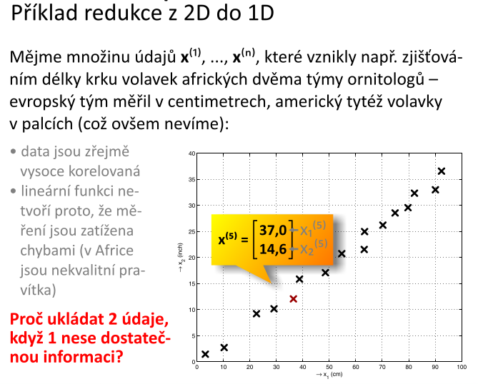    

- klíčem k dobře provedené redukci je najít takovou polohu redukovaného podprostoru tak, aby vzdálenost všech bodů (chyba ortogonální projekce) byla co nejmenší

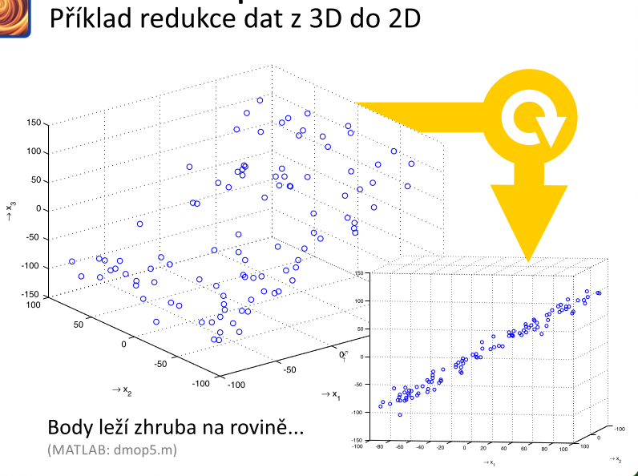

- vhodná rotace báze a dostanu prostor, vidím změny v rozptylu (např. jedna dimenze má malý rozptyl)

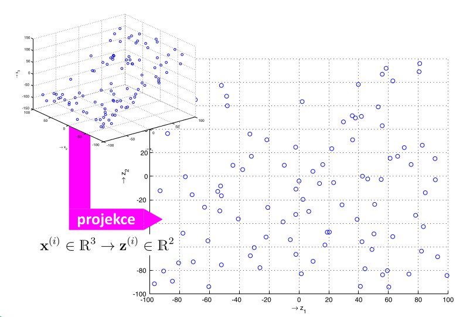

- _zahozená složka nepředstavuje zásadní informaci_
    - _s nejmenší chybou jsem byl schopný dovolit si zahodit část informace_ 
### použití a aplikace
- je to dobré k tomu, že mohu poznat charakter dat
    - u mnohorozměrných dat tak si je nedovedu představit/zobrazit
    - nevidím shluky, možnosti separace
- **lokalizace extrémů**
- **vizualizace**
- nákup nějakého produktu, má několik parametrů, snažím se vybrat ten nejvhodnější
- zjednodušení problému strojového učení
    - např. za účelem snížení času trénování atd.

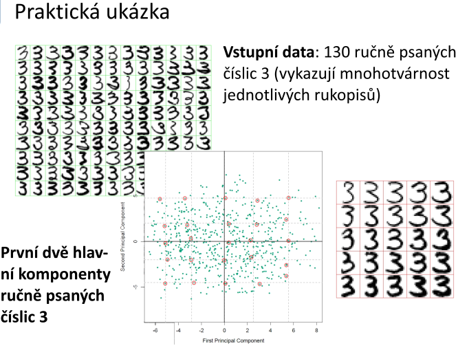

- dostanu původní bitmapy, které jsou ty nejreprezentativnější vzorky, které nejlépe vystihujou původní trénovací množinu a zanedbám to co představuje tu méně podstatnou část rozptylu dat
    - **to je generalizace**

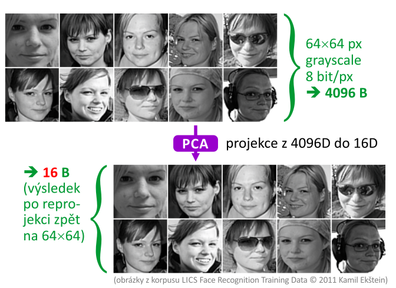
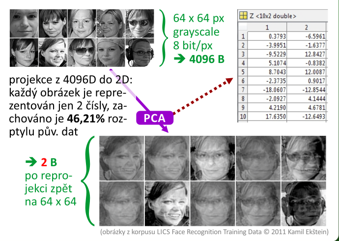
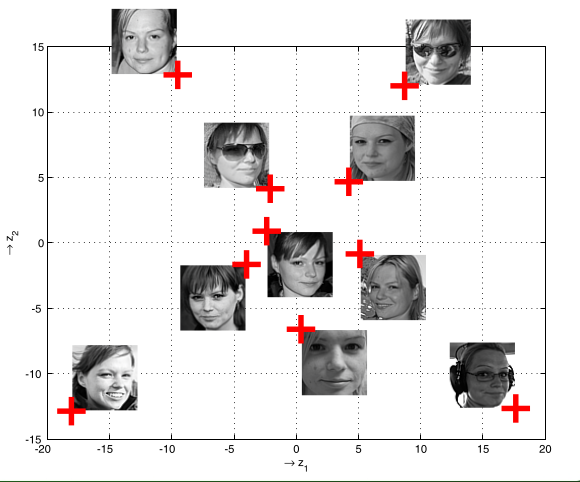

- **urychlení učení s učitele**
    - řídím míru zachování rozptylu dat
    - snížím dimenzionalitu trénovacích dat
    - kdykoliv to jde, tak se to vyplatí udělat
    - dovolí nám stanovit kolik dimenzí původního prostoru je podstatných
        - může se ukázat, že více než polovina lze zahodit
- **nevhodné je použít PCA při přeučení!!!**
    - velmi riskujeme 
        - zanedbám podstatnou informaci
    - lepší je použít regularizaci, prořezávání, cross-validaci
- zjistit pomocí PCA kolik dimenzí je potřeba pro kódování informace
- nejprve zkusit natrénovat bez PCA, pokud to nejde, je to náročné, tak PCA
- PCA nelze použít jako klasifikátor

## technika PCA 
- analýza hlavních komponent
- projekce z prostoru o `n` rozměrech do prostoru o `k` rozměrech, kde `k` je menší než `n`
    - potřebujeme to udělat tak, aby chyba projekce, která nastane, byla co nejmenší
- rychlý, stabilní, jednoduchý
    - algoritmus vždy dojede
    - neexistuje sada dat, která by vedla k havárii
- klade na data požadavky
- **PCA má za úkol nalézt takovou polohu redukovaného podprostoru tak, aby chyba projekce byla minimální**

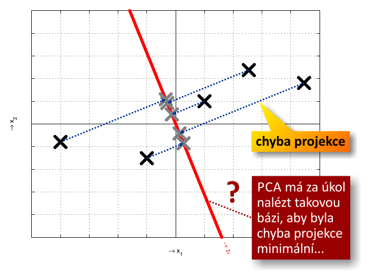

- budeme muset najít takovou transformovanou bázi tak, aby projekce byla s nejmenší projekční chybou
    - **budu muset nalézt `k` bázových vektorů takových, aby tvořily ortogonální bázi a zároveň projekce původních `n` dimen. dat do jimi generovaného prostoru proběhne s nejmenší chybou**

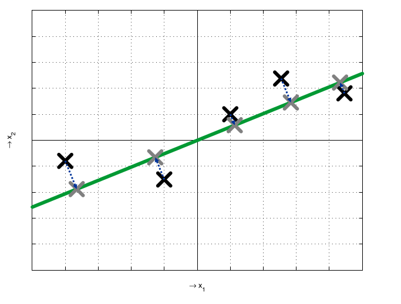

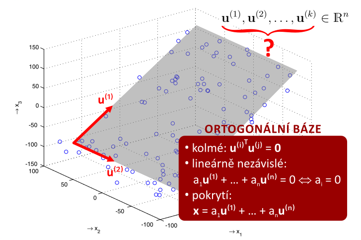

- bázové vektory: 
    - by na sebe měly být kolmé
    - lineárně nezávislé
        - _aby jednou souřadnicovou komponentou nešel vyjádřit pohyb v jiné než právě té dané ose_ 
        - _aby se mi to, když tím hýbu v jedné ose, nehýbalo v jiné ose_
    - pokrytí
        - abych dokázal libovolný prvek v prostoru vyjádřit jako lin. kombinaci bázových vektorů
- **hlavním úkolem je tedy najít vhodně bázové vektory**
- **nejedná se o lineární regresi!**
    - u lineární regrese vyjadřuji chybu jen v jedné souřadné ose
    - u hledání bázových vektorů hledám nejmenší vzdálenost ve všech dimenzích

### preprocessing dat 
- vstup je množina `m` bodů (naměřených hodnot) v `n`-rozměrném prostoru - nazývá se **datová matice** (je transponovaná, každý sloupec je vzorek trénovací množiny)
- nejdřív se musí pro každý sloupec (kanál příznaků) **spočítat střední hodnota**
    - získám vektor středních hodnot
- data v datové matici _očistím_ tak, že od každého prvku matice odečtu danou střední hodnotu
    - střední hodnotu daného sloupce, kde se právě nacházím
    - důsledek je takový, že některé hodnoty ve sloupci jsou záporné
- **škálování/normalizace vstupu**
    - _potřebuji naškálovat vstup_
    - když složky napříč sloupcemi mají výrazně jiné hodnoty 
        - u příkladu s vrtulníky např. počet motorů a výkon motoru
    - je vhodné vymyslet nějaký koeficient, kterým se přenásobí každý ze sloupců tak, aby jejich rozsahy byly souměřitelné
        - lze vybrat např. maximum dané složky v absolutní hodnotě přes všechny vzorky, a tím položky vydělit
        - tím dostanu normalizovanou podobu dat s nulovou střední hodnotou a normalizovaným rozptylem

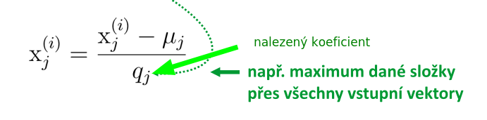

- pořadí škálování a normalizace záleží na charakteru dat
    - chceme ale oddálit problém meze strojové přesnosti 

## algoritmus
- preprocessing
- výpočet kovarianční matice
    - spočítá se z datové matice
    - vynásobím datovou matici samu sebou (transponovaná)
        - **normalizuji dále na počet prvků**
- výpočet vlastních vektorů pomocí **SVD**
    - pokusím se o vyhledání směrů v kovariační matici, ve kterých je největší rozptyl (změna)
        - **nalezením vlastních vektorů kovariační matice naleznu směry největšího rozptylu dat**
- z matice `U` si vezmu pouze několik bázových vektorů `Ur` (redukovaná)
    - vybírám si prvních `k` bázových vektorů v jejichž směrech jsou největší kovariance (tj. rozptyl původních dat) 
    - **předpokládám, že rozptyl kóduje tu nesenou informaci**
        - kdybych zahodil první bázový vektor, tak zahodím ten směr, který nese nejvíce informace

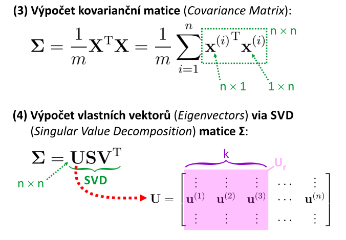

### realizace pomocı́ výpočetnı́ho softwaru
- SVD nemá cenu implementovat ručně, je lepší použít již hotové knihovny, které jsou řádně optimalizovány
###  reprojekce 

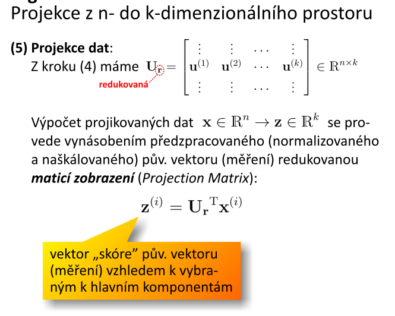

- po výběru `k` transformovaných bázových vektorů, čímž získám projekční matici, kterou když vynásobím původní data, tak se dostanu do nové pozice vyjádřené v souřadnicích původního prostoru
    - dimenzionalita nového vektoru bude **nižší**
    - mám novou redukovanou bázi
- souřadnice nového vektoru představují "skóre" vzhledem k transformaci
    - **pozice v původním prostoru vyjádřená v nové bázi** 
    - **tyto hodnoty nemají žádnou fyzikální interpretaci v prostoru původní úlohy** 
- projekční chyba je daná tím kolik těch bázových vektorů původního prostoru vyhodíme (jak moc malá je oproti dimenzi původního prostoru je ta redukovaná báze) 
- výsledkem je odhad původního bodu s chybou projekce

### rekonstrukce dat

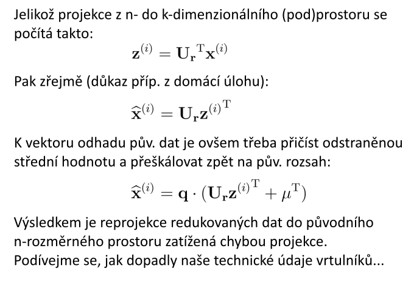

- po rekonstrukci dat lze pozorovat jak velká je chyba projekce

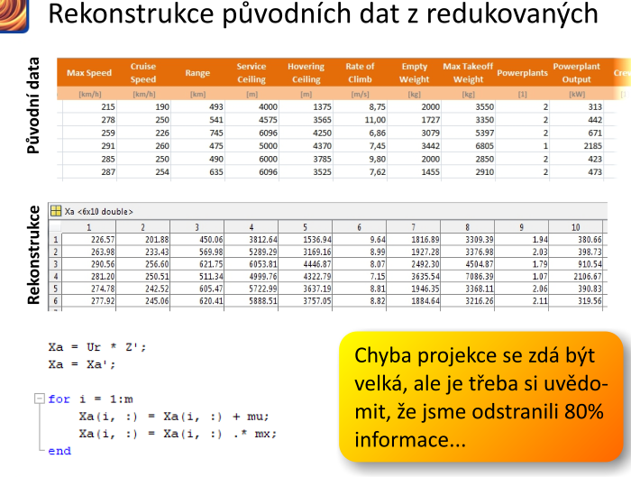

### stručný popis SVD
- faktorizace SVD
- vektor `u1`, nová báze a nový směr, ve kterém kovariance je největší
    - `u2` druhá největší, `u3` třetí největší
    - **bázové vektory jsou řazené zleva doprava tak, jak se snižuje kovariance**
- realizuje se přes determinanty
- na to je v Matlabu funkce

## výběr počtu hlavnı́ch komponent
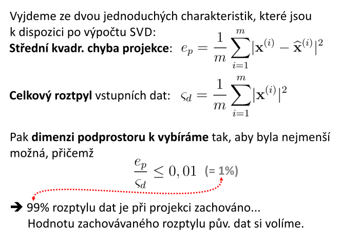
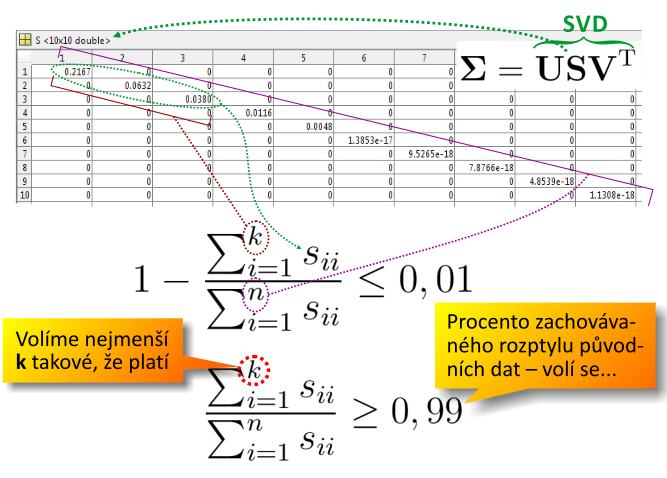

