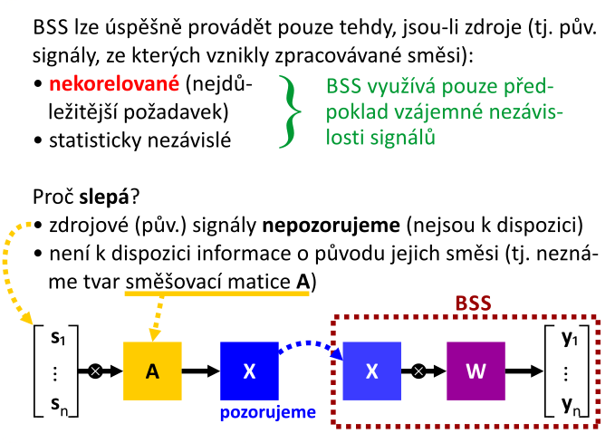
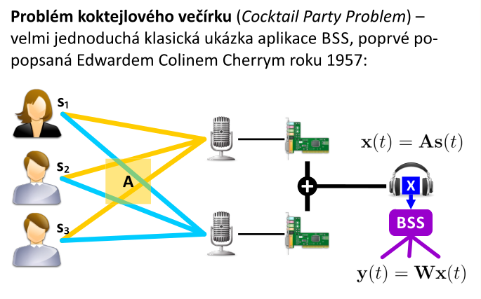
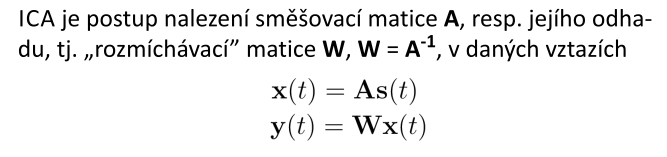
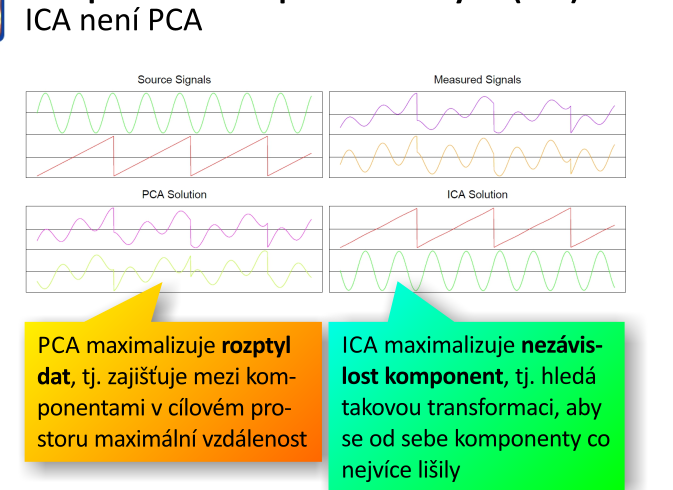
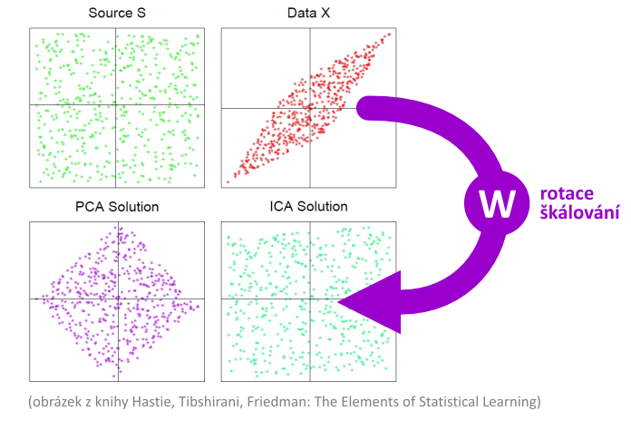
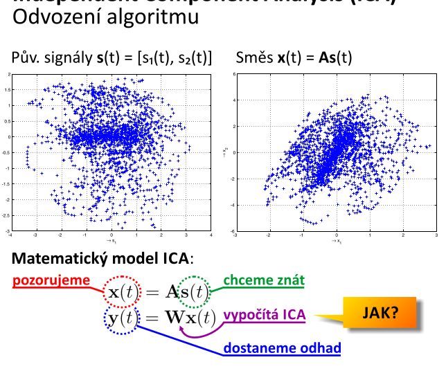
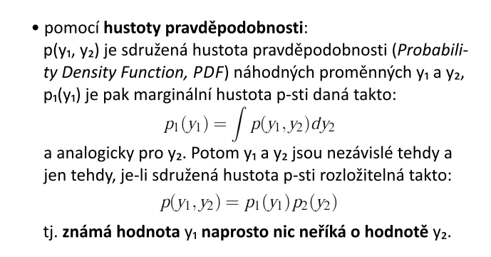
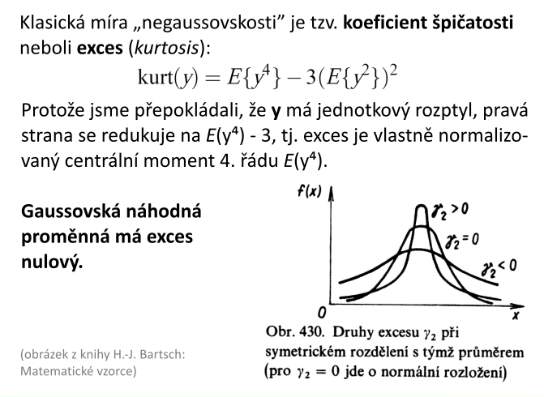

# 14. Slepá separace zdrojů — popis techniky a motivace k jejı́ aplikaci, souvislost se strojovým učenı́m; základnı́ vlastnosti, problém koktejlového večı́rku, aplikačnı́ domény a specifika; přehled metod slepé separace signálu; technika ICA, popis, podmı́nky a omezenı́; nezávislost komponent a jejı́ matematické modelovánı́; hlubšı́ porozuměnı́ principu ICA – CLV, mı́ry negaussovskosti“; algoritmus ICA, volba počtu iteracı́.

## popis techniky a motivace k jejı́ aplikaci + souvislost se strojovým učením
- problém učení bez učitele
- používají se u číslicového zpracování signálů, statistiky, klasifikace a rozpoznávání
- cílem je separovat např. v signálu šum od obsahu
    - _v autobuse voláme přes telefon a je třeba oddělit náš hlas od zbytku zvuků v autobuse_
- **slepá** - protože nevíme o zdroji signálu nic
- bílý šum + bílý šum
    - nedokážeme oddělit

## základnı́ vlastnosti

- existují zdroje, generují signály
- směšovací matice
    - kombinuje signály ze zdrojů a udělá z něj jeden
        - kombinuje => vynásobí
- _výsledek této matice pozorujeme_
- při slepé separaci se pokoušíme najít _rozměšovací_ matici, kterou vynásobíme pozorovaný signál a získáme tak signály z jednotlivých vzorů

## problém koktejlového večı́rku
- místnost, kde je party, spousta lidí, kteří hovoří
- do každého rohu místnosti umístíme mikrofony
- tím získáme záznam směsi těch původních zdrojových signálů

## aplikačnı́ domény a specifika
- dá se použít všude, kde máme signál zatížený artefaktema
    - magnetoencefalografie (MEG)
        - separace signálů za účelem odstranění artefaktů, tj. následků rušení vnějšími zdroji elmg polí (např. kovové hodinky pacienta)
    - echo cancellation & dereverbation
    - potlačení šumů
    - analýza komplexních systémů
        - chemické provozy
        - jaderné elektrárny
## přehled metod slepé separace signálu
- **ICA**   
- **PCA**
- **SVD**
- SSA
- CSP

## technika ICA
- předpokladem je statistická nezávislost negaussovských zdrojových signálů
- přímo z definice vyplývá, že ICA nedokáže ze směsi separovat např. bílý šum
- výpočetní postup, který dovoluje separovat vícerozměrný signál na aditivní komponenty
    - předpokladem je to, že smeš vznikla sečtením signálů (viz koktejlový večírek)

- _budeme se pokoušet nějakým způsobem rozmíchávat tu směs. Odhadovat matici W, což je inverze matice A, která nám slouží jako směšovací matice_
    - odhadneme matici `W`, která je inverzní ke směšovací matici `A`
    - výsledné rozmíchané komponenty budou co nejvíce nezávislé
- **chceme aby statistická nezávislost separovaných komponent byla co nejvyšší možná** 
    - tou metrikou, která nám posoudí vhodnost příslušného místa v prostoru, který tvoří jednotlivé prvky matice `W` bude míra statistické nezávislosti po provedení rozměsi 
- nabízí se různé metriky:
    - entropie
    - vzájemné informace
    - **koeficient spičatosti**

- nedá se odhadnout v jakém kanálu máme jaký zdroj

### popis, podmı́nky
- směs nesmí mít gaussovský histogram

### omezení

- nelze určit rozptyl (energii) nezávislých komponent
    - amplitudu omezim, zmenším si tím prohledávaný prostor
    - pohybuji se po jednotkové kružnici
        - realně mohu rozmíchávat třeba 50 signálů, pak to bude hyper-koule
- nelze určit pořadí nezávislých komponent
    - vhodným prohledáváním stavového prostoru najdu tu rozměs, ale můžu ji najít tak, že jednotlivé kanály jsou rozházené - v jiném pořadí

### nezávislost komponent a jejı́ matematické modelovánı́
- lze modelovat pomocí hustoty pravděpodobnosti:
    - víme, že pokud máme náhodné proměnné `y1` a `y2`, tak jsou nezávislé tehdy a jen tehdy, je-li sdružená hodnota pravděpodobnosti rovna součinu marginálních hustot

- když máme střední hodnotu sdruženého signálu, tak ten se rovná součinu středních hodnot těch jednotlivých signálů (veličin)
- **budeme posuzovat negaussovskost histogramu po rozměsi**
    - pro každou rozměs si vyrobím histogram
    - _začnu s tím natáčet_ - hledáním koeficientů matice W
    - vyberu si tu polohu natočení takovou, že histogram je nejméně gausovsský 
    - míra negaussovskosti?

## hlubšı́ porozuměnı́ principu ICA – CLV
### CLV
- když sčítáme náhodné realizace náhodných proměnnných/výsledků procesů, které mají obecně rovnoměrnou distribuci, tak čím více jich sečteme, tím více se blížíme normální distribuci

## mı́ry negaussovskosti
- **koeficient špičatosti**

    - když je exces nulový, tak je to pěkný gaussovský kopeček
        - vyšší exces => více špičatý kopeček
        - menší jak nula => plochý kopeček méně gaussovský
    - v praxi ale není moc použitelný, protože díky čtvrté mocnině je velmi citlivý na marginální hodnoty
        - např. výpadek vzorku v audiu umocněný na čtvrtou, tak to velmi rozhodí střední hodnotu
        - tato míra není robustní => používá se pro vysvětlení ICA algoritmu
- **negentropie**
    - gaussovská náhodná proměnná má nejvyšší entropii ze všech náhodných proměnných se stejným rozptylem
        - stejný rozptyl, gaussovský kopec, osciluje to kolem střední hodnoty
            - velká entropie, protože nelze odhadnout jaká bude další hodnota
            - narozdíl třeba od pily
    - ze statitstického hlediska je negentropie optimálním odhadem negaussovskosti
    - negentropie se velmi obtížně vypočítává
- **vzájemná informace**

## algoritmus ICA
- **ustředění** 
    - ICA je citlivý na offset (nesmí ho mít), střední hodnota signálu musí být nulová 
    - od pozorovaní směsi signálu odečtu její střední hodnotu po komponentách
    - není to nutné, ale usnadní to algoritmus ICA, zlepšit jeho konvergenci 
    - když ta data mají offset, tak hyperkoule nemá střed v nule
- **bělení** (whitening)
    - lineární transformace pozorované směsi signálů
        - zajistíme, aby složky transformované směsi byly nekorelované, jejich rozptyl byl jednotkový a kovarianční matice jednotková
    - provádí se po ustředění signálu, před výpočtem ICA
    - tím dostanu předzpracovaný signál způsobilý pro algoritmus ICA
- **samotný algo** (gradientní metoda)
    1. inicializace váhového vektoru náhodně
    2. **sphering**, potřebuji se pohybovat po hyperkouli (**provedu SVD**)
    3. iteračně od 1 do počtu iterací
        1. odhad aproximace rozmíchaného signálu (v první iteraci se pokusím aproximovat náhodným vektorem)
        2. výpočet gradientu `g` z odhadu excesu `y`
        3. oprava váhového vektoru dle gradientu
        4. normalizace váhového vektoru

## volba počtu iteracı́.
- stabilita koeficientu špičatosti rozmíchaného signálu je jedním z konvergečních kritérií 
- postupně během optimalizace velikost úhlu mezi gradientem a výsledným vektorem klesá => může sloužit jako konvergenční kritérium
