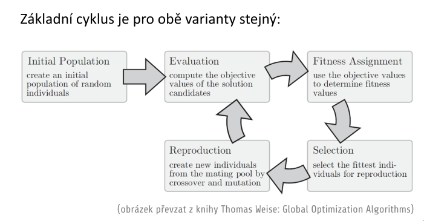
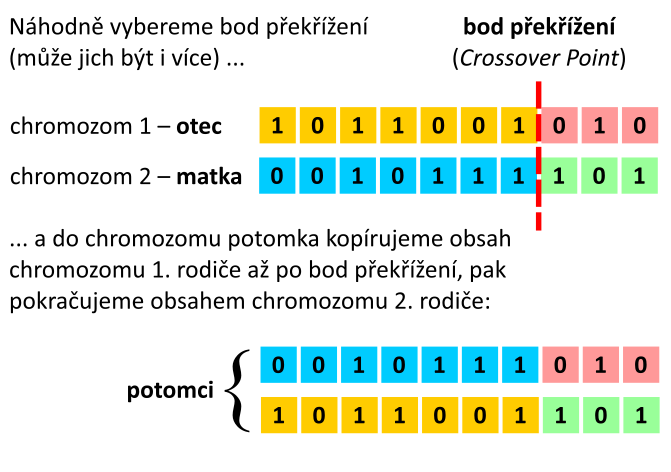
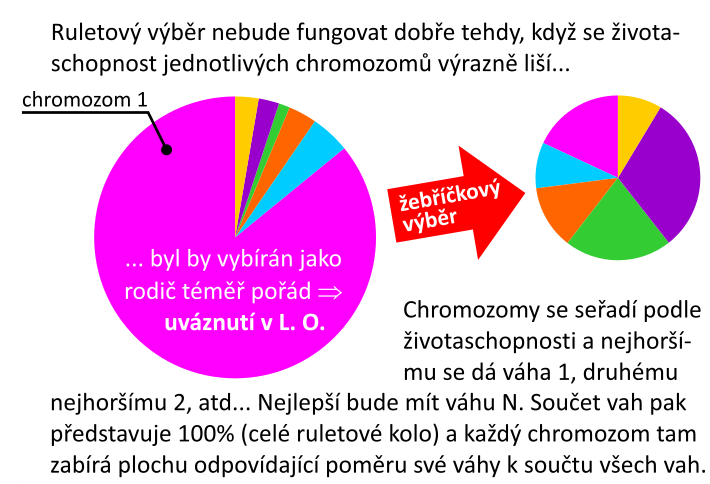

# 15. Evolučnı́ výpočty a genetické algoritmy — popis techniky, souvislost s biologickou evolucı́, motivace k aplikaci a aplikačnı́ oblasti; techniky kódovánı́ genotypu; fitness function; obecný předpis evolučnı́ho algoritmu, SOEA vs MOEA; operátory a parametry GA; strategie výběru jedinců nové generace.

## popis techniky, souvislost s biologickou evolucı́
- metaheuristický optimalizační postup
    - nevycházíme přímo z heuristiky
    - máme vyšší obecnější informaci nad heuristikou
        - tento postup teprve vede k volbě heuristiky
- základním mechanismem je práce s populacemi řešení, za využití biologických postupů jako je dědičnost, křižení, mutace a kompetetivní výběr
- _jeden z projevů, že je nejlepší je to, že se rozmnoží mnohem pravděpodobněji a mnohem časteji než ostatní_

## motivace k aplikaci a aplikačnı́ oblasti
- hlavní výhodou je to, že podobně jako NS fungují velmi dobře na široké škále úloh
    - genetiku lze použít skoro na vše v UI
- možné použití:
    - hledání řešení soustavy rovnic
    - optimální rozhodovací hranice u klasifikace obrázků
- obecně genetické algoritmy mají charakter černé skříňky
- stanovení cíle optimalizace nevyžaduje příliš hluboké porozumění řešeného problému
- definuji pomocí genetických operací vlastnosti hledané heuristiky, a ona se mi tvoří iterací EA algoritmu sama
- **nevýhody**
    - může se stát, že nenalezne globální minumum => pouze lokální
    - iterační proces, který může trvat dlouho
    - není garantovaná dostupnost řešení v garantovaném čase
        - neexistuje stabilita času řešení
            - může být problém např. při řízení jaderné elektrárny
### biologická evoluce
1. jedinci v populaci vytváří přebytek potomků
2. bez přítomnosti vnějších vlivů velikost populace zůstává zhruba stejná
3. bez přítomnosti vnějších vlivů jsou zásoby potravy omezené, ale vývoj jejich množství je v čase stabilní
4. v případě pohlavně se rozmnožujících druhů jsou každí dva jedinci **odlišní**
5. odlišnost ovlivňuje jejich schopnost přežít do dospělého věku a mít potomky
6. značná část specifické výbavy jedince (konkrétní odlišnost jedince) se dědí
7. jedinci s horší dědičnou výbavou, kteří jsou odlišní špatným způsobem mají nižší pravděpodobnost přeživší
8. přeživší jedinci se rozmnoží a pravděpodobně předají svou specifickou výbavu svým potomkům
9. tímto způsobem se daný druh mění a přizpůsobuje se konkrétnímu prostředí ve kterém žije
    - může dojít i ke vzniku zcela novému druhu

### aplikace genetické terminologie
- **populace**
    - množina všech kandidátních řešení
- **chromozom**
    - kandidátní řešení
- **gen**
    - jednotlivé pozice v chromozomu jsou geny
- **alela**
    - konkrétní hodnota genu

### řešení problému - řešení rovnice
- výběr jedinců, kdy každý jedinec představuje kandidátní řešení
    - číslo ze stavového prostoru, které může být kořenem rovnice
- na úlohu lze nazírat tak, že se snažíme křížením méně vhodných kandidátů (např. čísel, která nejsou kořenem zadané rovnice) "vypěstovat" nějakého vhodnějšího kandidáta
- musíme umět reprezentovat genotyp
- musíme umět vyjádřit životaschopnost

## techniky kódovánı́ genotypu
- **zakódování genotypu jedince je silně závislé na typu řešeného problému**
    - neexistuje obecné řešení
- mezi běžné způsoby kódování patří:
    1. **binární kódování (_Binary Encoding_)**
        - `0101010000` - počátek vývoje genetických algoritmů
        - (**genetické algoritmy jsou podmnožina evolučních algoritmů**)
        - použití např. při problému _balení evakuačního zavazadla_
            - každý bit odpovídá použití (sbalení) jednoho předmětu
    2. **permutační/numerické kódování (_Permutation Encoding_)**
        - chromozom je tvořen posloupností přirozených čísel
        - hodnota alely má význam indexu
            - index např. ukazuje na místo/uzel kam se dostanu
        - používány jsou hlavně k řešení úloh hledání optimálního uspořádání
        - kanonickou úlohou je úloha _Obchodní cestující_
    3. **kódování hodnotou (_Value Encoding_)**
        - chromozom je tvořen množinou hodnot (reál. čísla, znaky, výčtové konstanty)
        - vhodné pro nestandardní, komplikované úlohy
        - **nevýhoda**
            - obě dvě operace **křížení** a **mutaci** musím nadefinovat specificky
        - příklad: trénování neuronové sítě
    4. **kódování stromem (_Tree Encoding_)**
        - chromozom představuje n-ární strom objektů
        - doména použití:
            - dynamické programování
        - problém: hledání funkce podle tabulky hodnot
            - mám zadanou tabulku hodnot a hledám funkci, která je ideálním interpolantem
            - kódování => rozkladový strom předpisu funkce
        - lze řešit takto řešení diferenciálních rovnic

## fitness function
- obdoba **cenové funkce**
    - cenová funkce popisuje úlohu globálně
- vyjadřuje vhodnost jednoho konkrétního kandidáta na řešení
    - _jak blízko je získaný kandidát k cíli té optimalizace?_
- musí se specifikovat dle konkrétní úlohy
- je to metrika a musím mít vlastnosti metriky
    - pozitivně definitní
    - platí trojúhelníková nerovnost
    - symetrická
- mnohdy není analyticky vyjádřitelná

## stavový prostor a prostor řešení
- **stavový prostor**
    - kandidáti řešení úlohy jsou **fenotypy**
    - instance genotypů vytvořenými tzv. genotypově fenotypovém mapováním
- **prostor řešení**
    - abstrakcí množiny všech možných řetězců DNA v přírodě
    - jeho prvky jsou abstrakce genotypů
    - v našem případě stavový prostor je prostor všech existujících realizací konkrétního chromozomu, který kóduje tu původní fyzikální realitu úlohy
    - je to transformovaný stavový prostor
        - nejedná se o původní stavový prostor
    - genotypově fenotypové mapování
        - realita úlohy je mapovaná nějakou funkcí na realitu těch kandidátů

## obecný předpis evolučnı́ho algoritmu

1. **start**
    - vygenerujeme náhodnou populaci, která má `n` chromozomů (`n` jedinců)
2. **fitness**
    - u všech jedinců populace vyjádříme fitness funkci
3. **nová populace**
    1. **výběr**  
        - budeme vybírat vhodné rodiče podle jejich fitness funkce
        - čím větší hodnota fitness funkce tím větší šance na přežití
    2. **křížení**
        - vybereme rodiče a vytvoříme potomky
    3. **mutace**
        - potomek dostane s nějakou pravděpodobností mutaci
        - náhodně jim změníme nějaký gen
            - kdybychom mutaci neprováděli, tak by nám mohlo řešení úlohy zkonvergovat do lokálního optima, všechni jedinci budou z jednoho lokálního optima a jejich křížením nemáme šanci se dostat ven
    4. **přijetí**
        - po provedení mutace zkoumáme zda jsou jedinci v pořádku
        - můžou vůbec být zařazení do nové populace?
        - mutace může vést k tomu, že potomci budou úplně mimo stavový prostor úlohy
4. **nahrazení**
    - v aktuální populaci nahradím dle výběrové strategie
5. **test**
    - bylo dosaženo cíle?
6. **iterace**
    - pokračuji na krok **2.**
## SOEA vs MOEA
- **SOEA** (*Single Objective Evolutionary Algorithm*)
    - cílem je optimalizace jednoho kritéria
    - jediná globální cenová funkce původní fyzikální úlohy
    - hledá řešení s ohledem na jediné kritérium
    
- **MOEA** (*Multi-Objective Evolutionary Algorithm*)
    - optimalizačních kritérií je více
    - nemůžeme všechny splnit optimálně
    - nelze nalézt optimum ve všech kritériích

## genetický algorítmus
- je heuristický postup hledání řešení aplikací principů evoluční biologie
- použijeme GA operátory **křižení** a **mutaci**

## operátory a parametry GA
### křízení
- _crossover_
- v každém chromozomu nezávisle dle reprezentace vybereme náhodně bod překřížení (může jich být více)

- způsobů provedení křižení může být celá řada:
    - 1 či více bodů překřížení
    - způsob náhodného výběru polohy bodu překřížení
    - optimalizace vzdálenosti bodů překřížení
    - volba počtů rodičů
- závisí na způsobu kódování chromozomů
- **je třeba se bránit stavu, kdy křížením budou opakovaně vznikat stejné populace**
### mutace
- **vždy se provádí až po křížení**
    - křížení vede ke vygenerování v oblasti kde se vyskytují rodiče
    - mutace vede k opuštění lokálního optima
- nemusím nutně provést mutaci vždy
- **binární kódování**
    - inverze několika náhodně vybraných bitů
- **numerické kódování**
    - mutaci lze realizovat prohozením hodnot např. 2 sousedních genů
- po mutaci musím kontrolovat, zdali po mutaci jsou mutanti životaschopní
    - vůbec by totiž nemusel sedět do stavového prostoru úlohy

### parametry
- **pravděpodobnost křížení**
    - 0-100%
        - obvykle někde kolem 50%
        - je li 0%, tak neznamená, že je nová populace stejná
        - potomci mohli být zmutovaní
- **pravděpodobnost mutace**
    - 0-100%
        - pravděpodobnost by měla být spíš nižší
        - potřebujeme stabilitu
- **velikost populace**
    - pokud máme malou populaci, tak máme omezené možnosti křížení a prohledává se tak pouze malá část stavového prostoru => konvergujeme pomalu
    - pokud je příliš velká, tak se celé řešení zpomaluje (výkonostně)
    - optimální parametr neexistuje
## strategie výběru jedinců nové generace.
- **výběr ruletovým kolem**
    - každý rodič dostane šanci úměrnou hodnotě jeho fitness funkce účastnit se páření
    - ani ruletové kolo ale neřeší, že jeden chromozom bude mít příliš velkou šanci
- **žebříčkový výběr**
    - váhy jsou chromozomům (celkově jich je `n`) přiřazovány dle jejich pořadí dle fitness funkce od konce
        - nejhorší dostane váhu `1`
        - druhý nejhorší dostane `2`
        - třetí nejhorší dostane `3`
        - ...
        - nejlepší chromozom dostane váhu `n`

- **výběr ustáleného stavu**
    - značná část chromozomů přežije do další generace (v přírodě)
    - z každé generace vyberu několik nejlepších jedinců s nejlepší fitness funkcí, kteří jsou přímo překopírovaní do další generace
    - naopak `n` nejhorších odstraním a nahradím potomkama `n` nejlepších
    - zbytek přežije do další generace
- **elitářství**
    - vemu `n` nejlepších a ty beze změny překopíruju do další generace
    - zbytek generace vytvořím klasickým způsobem
    - zabraňuje ztrátě nejlepšího řešení

## oblasti použití a příklady
- nasazují se na NP-hard problémy
- strojové učení
- automatické generování programů
- predikce, analýza dat
- návrh topologie a trénování neuronových sítí
- logistika

## výhody
- jsou přiřozeně paralelizovatelné
- odolnost vůči uváznutí v lokálních extrémech
- snadná implementace

## nevýhody
- výpočetní náročnost
- pomalá konvergence
- citlivost na volbu vhodné funkce životaschopnosti
- mapování stavu úlohy na obsah chromozomu 
